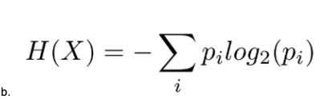

# Master DSI notes


 ## Relevant links 
* [Course Page](https://github.com/GalvanizeDataScience/course-outline/tree/20-10-DS-DEN_DEN19)

* [Quick Reference guide](https://github.com/GalvanizeDataScience/course-outline/tree/20-10-DS-DEN_DEN19/quick-reference)

* [Pandas Groupby syntax](https://pandas.pydata.org/pandas-docs/stable/user_guide/groupby.html)

* [Matplotlib intro syntax]()

* [Pandas lecture](http://localhost:8888/notebooks/post-lecture_intro_pandas_notes.ipynb)

* [Pandas syntax page](https://pandas.pydata.org/pandas-docs/stable/reference/api/pandas.DataFrame.html)


-----------------------------------------------------

## Career services

* [Deliverables Dashboard](https://docs.google.com/spreadsheets/d/12de6aB2Yx0S47aQZsFyVX4xf1hBwftkaWRikw19mRWQ/edit#gid=1543183776)


2 - intro to career serviecs
3 - linkedin
5 - resumes
6 - inortmational interviews
7 - professional introductions & building rapport
8 - cover letters and interview prep
9 - public speaking and job search strategy
10 - behavioral mock interviews and Salary negotiation

## Normal Imports

```python
import numpy as np
import scipy.stats as stats
import matplotlib.pyplot as plt
import pandas as pd

plt.style.use('ggplot')
```

## Imports for Regression
```python
import numpy as np
import pandas as pd
from pandas.plotting import scatter_matrix

from sklearn.linear_model import LinearRegression, Ridge, Lasso
from sklearn.model_selection import train_test_split, KFold
from sklearn.preprocessing import StandardScaler
from sklearn.base import clone

%matplotlib inline
import matplotlib.pyplot as plt
```


--------------------------------------------
## Del, Topics to study tonight
* Skew, kurtosis
* Linear regression, overall view
* 


-----------------------

## Markdown style Guide
* One '#' is used for the biggest size text
* Two '##' is used for second biggest size text
* To post a link use ['link title'](linkgoes here)
* To use bullet point use '*'
* To make a code block use ' ``` '
* Images - 

-----------------------------------------
## Week 2 Student review

1. What distribution would you use in the following cases:

What is the probability that the mean volume of 50 bottles is less than 500 ml? Normal distribution

Deciding to go for a run or not. Bernouli

Determining how many days pass before you finally decide to go for a run. Hypergeometric Distribution

Determining how likely it is that you go for 10 runs in a month. Binomial

Calculating which day of the month you buy new shoes. Possibly uniform, as it could be completely random giving the lack of information provided. Could be geometric as well.

Assuming you run at a 9 minute mile avg pace, determining how likely it is that you pass the 3 mile mark in a race in 25 minutes?

Poisson.


2. What is the central limit theorem?
The central limit theorem allows us to make probabilistic statements about the sample mean from any population using the normal distribution.

3. A bootstrap sample from a sataset is a sample taken with REPLACEMENT from the data set whose size is the size of the dataset itself. 

4. Here are the numbers in a list:
[3, 4, 5, 7, 8, 10, 12, 13, 14, 15, 16, 18, 19, 21, 22, 23, 24, 25, 26, 31, 42, 60, 69, 86, 108, 256]

For this list:
a) Find a 90% confidence interval for the mean using the Central Limit Theorem.

def confidence_interval(mean, st_err, num_std):
    ci = [mean - num_std * st_err, mean + num_std * st_err]
    return [round(val, 3) for val in ci

b) Find a 90% confidence interval for the mean using bootstrapping.
c) Find a 68% confidence interval for the standard deviation using the Central Limit Theorem.
d) Find a 68% confidence interval for the standard deviation using bootstrapping.
e) Either a), b), c) or d) is a trick question. Which one is it, and why?

-------------------------------------------------------------------------------------------------------------------

## Week 3 Review questions
1. Estimate the run-time complexity (O(N) notation) of the following code:
  ```python
  def find_duplicates(l1, l2):
    '''
    searches through lists 1 and 2 and eliminates duplicate entries from list 2
    '''
    for item1 in l1:
      for item2 in l2:
        if item2 == item1:
          # removes item from list
          l2.remove(item2)
    return l1, l2     

  ```
 A) The run time complexity here would be O(N^2), this is because of the nested for loop
 

  Write another function with the same functionality that works more efficiently. Use timeit to see how well you can do!

  (Hint: you could use something like
  ```np.random.randint(0, 100, 50)```
  to create random lists to practice with)

  ```python
  def a_better_function():
    for item in l1:
        if item1 in l2:
        l2.remove(item1)
```


2. Docker has become a common way to deploy applications.  Why is that?  Let's 
   say you have an application you wish to deploy. What steps would you go through
   to make your application deployable with Docker?  

    * Create an image
    * Push image to docker hub once code is complete
    * from there anyone can pull your image  

    * navigate to your working directory
    * docker start sparkbook
    * go to url localhost:88881


3. As you pair program, your partner puts this in your script:

```python
   import boto3
   boto3_connection = boto3.resource('s3')

   AWS_ACCESS_KEY_ID=ZYBGIZH66RA468VYYPCQ
   AWS_SECRET_ACCESS_KEY=gV97XiVqsSH5YhGAx18m0b/gxJdyH-yXS

   def print_s3_contents_boto3(connection):
       for bucket in connection.buckets.all():
           for key in bucket.objects.all():
               print(key.key)

   print_s3_contents_boto3(boto3_connection)
```

The code works, but you can't shake a feeling of impending doom.  Why?  What would
you do to allow the code to work but prevent financial ruin?

* The problem with the above code is that the aws secret key is hard coded into the code so anybody can see them and use your account. You need to imbed them in an object so people can't see them easily 


4. Use datatable 'customers' (example rows below), write a SQL query to....

| cust_id | cust_name | current_city | hometown |
|:----------:|:------------:|:----------:|:-----------:|
| 1 | Amanda | Atlanta | Raleigh |
| 2 | Brittany | Denver | New York |
| 3 | Charles | Paris | Raleigh |
| 4 | David | San Diego | Los Angeles |
| 5 | Elizabeth | Atlanta | London |
| 6 | Greg | Denver | Atlanta |
| 7 | Maria | Raleigh | New York |
| 8 | Sarah | New York | Raleigh |
| 9 | Thomas | Atlanta | Raleigh |

  **Assume that everyone has moved**

  A) Return the city with the highest population growth. (Highest net of people who currently live there minus people who used to live there)
        * SELECT COUNT(current_city)
        * INTO current_city_table
        * FROM customers

        * SELECT COUNT(hometown)
        * INTO hometown_table
        * FROM CUSTOMERS

        * SELECT current_city_table - hometowntable
        * 


    * 2 group by temp tables. One for city one for hometown. Then sum results and joiun them on current city


  B) Return pairs of "friends" (can be two columns or a tuple) that have both the same hometown and current city. Remove duplicates!  


5. Compare/contrast SQL and noSQL databases.  
  * What is one major organizational difference between the two?  
  * What type of data are ideal for each?  
    * NoSql is better for large amounts of data that isn't very organized, while SQL is better for data that's already been touched up a bit and generally smaller

  * In SQL, you have tables, rows, and columns.  What are analogous in MongoDB? 
    * The key-value pairs


| SQL                           | NoSql                                                                                                                                                                                  |
|-------------------------------|----------------------------------------------------------------------------------------------------------------------------------------------------------------------------------------|
| Rigid schema                  | Flexible schema                                                                                                                                                                        |
| Tables with fixed cols & rows | General purpose, key value: large amount of data with simple lookup queries Wide-column: large amount of data with predictable query patterns, graph: analyzing and traversing reality |
| Joins required                | Joins not typically required                                                                                                                                                           |


6. What is big data?  Big data are often referred to by 3Vs.  What are they?
    * Big data is data  (both structured and unstructured) that can't be stored on one machine
    * 3 v's - High Volume, Velocity Variety


7. Explain the concept of MapReduce in terms a 5th grader would understand. 
   Provide an illustrative example.

   * Given mixed inputs, map reduce will try to group smaller objects and count them within their own starting node. Then they will transfer those objects to another node to group them wil smaller objects from different starting nodes, again counting the total similar objects. Finally it will combine everything into one node, but now all similiar objects are grouped together with a total count for each object. 


8. What differentiates a Spark RDD from data stored in a single file (e.g. a .csv)?  

    * Spread across multiple computers. Distributed computing.


9. What is the difference between a Spark RDD and a Spark Dataframe?  
    Spark Dfs have a defined schema, spark RDD's do not.


10. Let's say one computer in you Spark cluster fails, but you still get results.
    How did Spark do this?!?  Your answer should include terms **RDD**, **Partition**, 
    **immutable**, **DAG**, **Lazy Evaluation**, **Spark Context**, 
    **Cluster Manager**, and **Worker Node**.

* Rdd - this means is distributed, so if you lost one part its ok and it wont shut down a whole system.

* Partition - a partition is just one piece of a distributed system.

* Immutable - 

* DAG - 

* Lazy evaluation - 

* Spark context - 

* Cluster manager - 

* Worker node - 


### Week 5 Review


1. What are the assumptions behind OLS linear regression?
    - Errors are iid~N(0, sigsq*l) -> Constant variance(Homoscedastic), independent, normally distributed with mean zero
        - The variance of the erros stays the same as the feature changes. Sigma is not dependent on X.
    - Observations are independent (consistent)
    - Model is linear
        - The 'linear' in the name "linear regression" does not mean that the model is attewmping to fit aq linear function of the raw fewatures. Instead, it means that the model is a linear function of the transformed features.


2. What are some metrics for linear regression goodness of fit, and what do they mean?
    - R^2 measure of variance explained by the model (always increases with more features - adjusted R^2helps with this)
    - F -test: Hypothesis test: null model w/ no predictors is sufficient
    - RSS and MSE measure of residuals, can compare to other model choices


3. In the context of machine learning, what are bias and variance? And what is the bias-variance trade-off?
    - Bias is when your line becomes underfit (model is too felxible) and misses whatever signal your datapoints are trying to show. The data is not influencing the model enough
    - Variance is when your line becomes overfit (model is too strict) and hits too many of your datapoints, Higher variance captures signal and noise

4. Explain the process you would use to make a generalizable supervised learning model. In the process, compare/contrast cross-validation using a single train-test split to k-fold. What advantage does k-fold have over a single train-test split? Is k-fold always best?

    1. Cross Validation process: 1) Split data (after splitting out hold out set) into training/validation sets, 2) use training set to train several models of verying complexity, 3) Evaluate each model using the validation set 4) Keep model that performs best on the valdiation set

    2. Single train-test split: After training only get one estimate of validation error- there is a chance this set is different than the training set, especially if it is a time series data set that has not been shuffled in the analysis.

    3. K-Fold: After training, get k estimates of validation error from the same model complexity, calcuate the mean validation error from K estimates. Given a more robust, less variable (potentially more biased) estimate.


5. A coworker explained his machine learning workflow to you, and you have a suspicion that there's something wrong about it:

"After I got the data I immediately did a train-test split to make a hold-out set. Then I standardized the remaining training data and used 5-fold cross-validation to determine the best model hyper-parameters. I used AIC as my model comparison metric. I took the hyper-parameters I got from cross-validation and trained a model on the full training set. Then I got my AIC on the hold-out set and it didn't do as well, by a long shot, as it did during cross-validation."

Where did he go wrong?


* He should have standarsized hold-out set with training mean and SD


6. What is the curse of dimensionality in machine learning? What can you do to address it?
    - As dimensions increase the data becomes farther apart (more sparse)
    - Fixed by: More data reducing unnecessary dimensions (features)


7. We talked about L1 and L2 regularization. What are they and in what situations might you use one instead of the other?
    - L1: Lasso regression, used for sparse models
        * Tends to set coefficients exactly equal to zero
    - l2 : Ridge regression used for dense models.
        * is computationally easier because it is differentiable

8. Draw a confusion matrix for binary predictions.

|                 | Predicted positive | Predictive negative |   |   |
|-----------------|--------------------|---------------------|---|---|
| Actual positive | True positive      | False Positive      |   |   |
| Actual Negative | False Negative     | True Negative       |   |   |
|                 |                    |                     |   |   |


A type-I error is a false positive (which I remember because that phrase is more common than false negative).
Accuracy = (TP+TN) / (TP+TN+FP+FN)
Sensitivity = Recall = TPR = TP / (TP+FN)
FPR = FP / (TN+FP)
Specificity = TN / (TN+FP)
Precision = PPV = TP / (TP+FP)
NPV = TN / (TN+FN)


9. Give an example for each case:

* Precision is more important than recall.
    - Sensitivity- Of items that are actually classified as "A" how many of your predictions were also classified as "A". probability something is predicted to be positive given it is actually positve

    - Precesion- Of items predictied to be classified as "A" How many are actually/truly classified as "A"; Probability something is actually positive given it is predicted to be positive.

    - Precison is more important than recall(Sensitivity)
    
    - Recall (sensitivity): is more important than precision
        - medical test - want to correctly 'predict
* Recall is more important than precision.

* You consider both to be important (and what metric would you use for that?)
    - Use the f-score. F score evaluates a test assuming that recall is Beta times as important as precison.


10. How is a ROC curve generated? What does it show?
     - An ROC curve is generated by graphing the TPR (sensitivity) and FPR (specificity) for various thresholds. It show how often your model ended up being right in it's predictions


11. What are the similarities and differences between linear and logistic regression and how do you interpret the coefficients in each case?

    - Logistic regression is used to predict the probability of a certain classification of a new data point
        1. Interpret the coefficients using the odds ratio - the ratio of the probability of the positive to the negative case
            - Log odds ratio (just take log of odds ratio): if we increase a particular feature by 1, then we will increase the log odds-ratio by corresponding coefficent

            - Linear regression trying to predict the numerical value of a data point?
                * Coefficents relay how much the target value will change with change in target feature, staying within the same population. 


## WEEK 6 REVIEW
1. Write out the cost functions for:
* Ordinary least squares

        RSS = sum(yi-yhat)^2

* Linear regression using L1 regularization: **Lasso Regression**


    sum(yi-yhat)^2 + lamda*sum|Bi|

* Linear regression using L2 regularization: **Ridge Regression**


* Linear regression using Elastic net

2. You're trying to make model that will predict the female gold medal winner in the high jump in the next Olympics. You have results and data for 1000 high-jumpers in the past. You're using four features: jumper_height, jumper_weight, best_jump_height, and fastest_100m_time as features and your model performs ... just ok during cross-validation. Then it hits you: you also have maximum_squat_weight for all the jumpers, why don't you use that as a feature too? Using this additional feature (5 total now) during cross-validation, however, you get widely varying estimates of model performance.


* What do you think is going on?

    Curse of dimensionality: As dimensions increasr the data becomes father apart (more sparse)
    * Fixed by: More data or reducing unnecessary dimmensions(features)

* As a bonus, how many data points would you need with 5 features to have the same sample density as your model had with 4 features?

    - n**(dnew/dold)
    - 1000**(5/4) = 5,624 data points (~4600 + than what you currently have)


3. Decision tree questions:
* Describe, step-by-step, how a decision tree is built.

    1. Start with the whole data and create all the possible binary decisions based on each feature (predictor)

        - For discrete features the decison is "in the class" or "not in the class" 

        -  For continous features the decison is threshold < value or threshold >_ value

    2. Calculate the gini impurity for every decision (or entropy)

    **GINI and Entropy only work on classification splits**

    
    

    3. Commit to the decision which results with the largest information gain
        - IG = information gain
        - Gi = gini impurity
        - IG = parent_gi - (child1_Gi * weight 1) - (child2_gi * weight2)

    
    4. Repeat the pricess for each split until the tree is fully grown or stopping parameters are met. 


* Describe how a binary split is made at a node in the case of:

    * classification: Is it class A or Class B (True or False)

    * regression: Is it > a certain value

    * You decide to use a Decision Tree on the Olympic high jumper problem and you end up with a model that does very well on the training data but predicts poorly in cross-validation. What can you do?

        - This model has too high of variance. if you want to stick to a single tree, you could prune the tree:
        
        - Pre-Pruning Techniques:
            * leaf size: Stop splitting when # exmaples is small enough
            * Depth - Stop splitting at a certain depth
            * purity - Stop splitting if enough of the examples are of the same class.
            * Gain threshold: Stop splitting when the information gain becomes too small.

        - Post-pruning techniques
            * Merge leaves
            * Number of leaf nodes: Stop splitting when number of nodes gets too high 

            * Or you could use a random forest model instead of a single decison tree, which would allow you to build out the tree to full depth, but will reduce the variance of the overall model when you take the average of the many trees.


4. What are the two things that make a random forest "random"?

    - Bootstrapping a different sample for each tree
    - Random feature selection at every note. 


5. What problem from bagging is solved by using a random forest? Hint: what type of algorithm is a decision tree split?

    - Bagging = bootstrap aggregating. Bagging improves random forest because it decorrelates the trees; it makes them more independent of each other by using subset sampling

6. You are a data scientist at a subscription company, and you decide to use a random forest model for predicting churn. The model works well, but your boss wants some insight into what factors contribute to customer churn. What can you tell him/her?

    - You can create a feature importance bar chart to illustrate which features are most important to the model, but this will not give insight into HOW the features are influencing the model. 

    - You can create a partial dependency plot to show your boss how features are influencing the model (the slope of these plots gives insight as to how much the target will change based on that feature)

7. Compare and contrast random forests and boosted trees with regards to:

    * The data that each tree in the ensemble is built on.
    
        - Bagging builds treees from bootstrapped samples (randomizing data samples). Random Forests in comparison randomize the features used to create the trees. Boosted tree are initiated with the original data and then they shift and become based on the residuals of that data after the first stump or tree.

    * How the quality of a split on a given feature and its value is evaluated.

        - Bagging will use whatever feature increases the IG for the bootstrapped data the best, random forests will use whatever feature of the randomly selected subset of features increases IG the most. 

    * The general depth of each tree.

        - Random forests go as deep as they need to, bagging howeverwill sometimes limit the tree depth. Boosted trees have limited depths, ADAboost typically only has two leafs while gradient boost will have 2-4 layers with 4-12 leafs depending on the model

    * The bias-variance trade-off associated with each tree in the ensemble.

        - Random forests have low variance and relatively low bias as well, bagged models have a bit more variance and slightly less bias but still have less variance than a single tree. A finished boosted model has low vairance and low bias because they are slow learners which allows them to adjust to the data without overfitting.

    * How the ensemble can achieve a low-bias, low-variance model.

        - We combine multiple weak learners (either high bias, low variance, as in high bias trees for bossting, or high variance, low bias, as in full grown decision tree) to make one strong learner. Then by the sequential addition of the models, the bias is decreased to get a low bias, low variance model. This is done either through aggregation or boosting. 


-----------------------

# Python

## Data wrangling with pandas workflow
1. Build a DataFrame from the data (ideally put all the data in this object)

```python
names = ['imdbID', 'title', 'year', 'score', 'votes', 'runtime', 'genres']
data = pd.read_csv('imdb_top_10000.txt', delimiter='\t', names=names).dropna()
print "Number of rows: %i" % data.shape[0]
data.head()  # print the first 5 rows
```
2. Clean the DataFrame. It should have the following properties:
* Each row describes a single object
* Each column describes a property of that object
* Columns are numeric whenever appropriate
* Columns contain atomic properties that cannot be further decomposed
3. Explore global properties. Use histograms, scatter plots, and aggregation functions to summarize the data.
4. Use groupby and small multiples to compare subsets of the data. 
```python
#mean score for all movies in each decade
decade_mean = data.groupby(decade).score.mean()
decade_mean.name = 'Decade Mean'
print decade_mean

plt.plot(decade_mean.index, decade_mean.values, 'o-',
        color='r', lw=3, label='Decade Average')
plt.scatter(data.year, data.score, alpha=.04, lw=0, color='k')
plt.xlabel("Year")
plt.ylabel("Score")
plt.legend(frameon=False)
remove_border()
```


## Libraries

### Pandas
* Indexing

```python
import pandas as pd # Standard import
```

```python
# Create a dataframe using pandas

import pandas as pd # I haven't actually done this in code yet. 
data_lst = [{'a': 1, 'b': 2, 'c':3}, {'a': 4, 'b':5, 'c':6, 'd':7}]
df = pd.DataFrame(data_lst)
df

Out[]:	a	b	c	d
0	1	2	3	NaN
1	4	5	6	7.0
```

```python
# how to create columns and rows with new data
# how to make columns and rows with new data
# Creating columns are rows with new data

data_vals = [[1, 2, 3], [4, 5, 6]]
data_cols = ['a', 'b', 'c']
df = pd.DataFrame(data=data_vals, columns=data_cols)
df

```

## What to do when you first get data with pandas


```python


# first steps to take when working with data in pandas
# how to begin with pandas
# step by step guide on how to start with pandas

# 1: Start with the basics - exploring the data

    df = pd.read_csv('data/winequality-red.csv')
    df.head()
    df.shape  # give you the number of rows and number of cols
    df.columns # gives you back a list of all the column names
    df.info()  # allows you to look at the data type for each column and the number of null values.
    df.describe() # gives you summary stats for all of your numeric columns
    df.tail() # shows you the lastr n rows
    df.unique()
    df['column name'].unique() # gives unique values in that column


# 2: Clean your data!

    df2 = df.copy() # best practice to make a copy of the original data
    cols = df2.columns.tolist()   # All this does is takes the column and put its content into a list format
    cols = [col.replace(' ', '_') for col in cols] # takes the list format and replaces all empty spaces with an underscore. ---- how to replace spaces with underscore in pandas
    df2.columns = cols  # THIS IS IMPORTANT. You need to re-assign the manipulated column back into the data frame.


    # If you need to rename a column in the original dataframe---
    # how to rename a column with pandas
    df.rename(columns={'original column name' : 'the_column_name_i_want_it_to_be_named_to'}, inplace = True)     # DONT FORGET THE INPLACE = TRUE!


# 2.5: Dealing with NULL data.
# how to get rid of null values
# how to fix missing values

    df.fillna(-1, inplace= True)  # this will fill all NA/NULL values with the value -1
    df.dropna(inplace = True)    # this will just drop all column/spaces that have a NULL value


     
    


# 3: Acessing your data!
    df['column name'] # grabs the column titled 'column name'

    df[['column1' , 'column2']]   # how to access multiple columns 

    df[:3] # this will grab from the beginning up to but not including the row at index 3

    df[:1] # this will grab up to but not including 


# 4: How to mask your data
df['column_name'] <= 0.08 # this just gives us a mask, tells us True or false wether each row fits the condition

df[df['column_name'] <= 0.08 ] # proper way to use a mask 
df[(df['column_name'] >= 0.04) & (df['column_name'] < 0.08)] # a more complicated mask

# 5: How to create new columns
df['new column'] = df['old column'] - df['old column2']


# 6: Groupby/groupby/ how to groupby in pandas

# when grouping you need to assign the group to a value or else it wil return the memory location.
# when you group, the column you group by becomes the index. It will return all columns based on the groupby'd column

    groupby_obj = df.groupby('column_name')
    groupby_obj.mean()
    groupby_obj.max()
    groupby_obj.count()

    # if you want to get a group by and a specific column:

    df.groupby('column_name').count()['column_name2]

    # how to group by multiple columns
    
    df.groupby(['column1', 'column2']).count()['column3']

    # how to apply statistics to a group by
    # how to group by an equation
    # advanced groupby

    df_new = df.groupby('column1').agg({'column2': 'sum', 'column3' : 'mean'}).reset_index()


# 7: How to sort using pandas
    # sorting data in pandas

    df.sort_values('column_name') # default here is ascending
    df.sort_values('column_name', ascending = False)


    # a more specific sort

    df['column_name'].sort_values(ascending = False) 

    # you can sort by multiple columns by placing them in a list
    # how to sort by multiple columns in pandas
    # it will sort the first column passed first, then the second

    df.sort_values(['column_1', 'column2'], ascending =[True, False]).reset_index(drop = True)


#8 how to combine datasets with pandas
    # how to join data sets in pandas


# first you need to look at the dummies method. 

column_name_dummies = pd.get_dummies(dataframe_df.columnname, prefix='quality')

# now to actually join. How to join datasets

    joined_df = dataframe_df.columnname.join(column_name_dummies)

# how to concat two dataframes together
# how to concatonate with pandas

joined_df2 = pd.concat([column_name1, df_dataframe], axis = 1)

# how to merge with pandas

pd.merge(red_wines_quality_df, white_wines_quality_df, on=['quality'], suffixes=[' red', ' white'], how = 'outer')
```


```python
# Reading in data with pandas/ reading external data/ import data
df = pd.read_csv('my_data.csv')
data = np.loadtxt('my_data.csv)


# if no header name
df = pd.read_csv('my_data.csv', header=None)

df = pd.read_csv('my_data.csv', header=None, names=['col1', 'col2', ...., 'col12'])
```

```python
# How to clean data / cleaning data with pandas

# Clean column names
df.columns

cols = df.columns.tolist()
cols = [col.replace('#', 'num') for col in cols] # this replaces the pound sign with num
cols = [col.replace(' ', '_'.lower())]
print(cols)

```
```python
# masking in pandas 
df['chlorides'] <= 0.08 # This just gives us a mask - tells us True or False whether each row 
                 # fit's the condition.

# To use a mask, we actually have to use it to index into the DataFrame (using square brackets). 
df[df['chlorides'] <= 0.08]


# Okay, this is cool. What if I wanted a slightly more complicated query...
df[(df['chlorides'] >= 0.04) & (df['chlorides'] < 0.08)]

```
```python
# creating and dropping columns in pandas
# how to create a column in pandas
# how to delete a column in pandas / delete column / drop column
df['non_free_sulfer'] = df['total sulfur dioxide'] - df['free sulfur dioxide'] # add a new column titled non_free sulfer

df.drop('non_free_sulfur2', axis =1. inplace = True) # Drop the non_free_sulfur2 column. Axis = 1 is referring to axis 1 which is columns

```
```python
# Null values in pandas / how to get rid of missing values / how to fill missing values in pandas
df.fillna(-1, inplace=True)
df.dropna(inplace=True) # Notice the addition of the inplace argument here. 
```


```python
# Cast the date column as datetime object / how to add date and time with pandas

df['incident_date'] = pd.to_datetime(df['incident_date'])

```

```python
# groupby in pandas / how to use grouby in pandas

df.groupby('quality') # Note that this returns back to us a groupby object. It doesn't actually 
                      # return to us anything useful until we perform some aggregation on it. 

groupby_obj = df.groupby('quality')
groupby_obj.mean()
groupby_obj.max()
groupby_obj.count()
# pull a specfic column from quality
df.groupby('quality').count()['fixed_acidity'] 

# We can also apply different groupby statistics to different columns...
# here we are grouping by quality but using a dictonary to return different aggregate functions upon different columns. Useful!
df.groupby('quality').agg({'chlorides': 'sum', 'fixed_acidity': 'mean'})
```
```python
# sorting in pandas / how to sort in pandas

df.sort_values('quality') # Note: this is ascending by default.
df.sort_values('quality', ascending=False)


df.sort_values(['quality', 'alcohol'], ascending=[True, False]) # ascending=False will apply to both columns. 
```
```python
# how to reset index in pandas / reset index in pandas
df.sort_values(['quality', 'alcohol'], ascending=[True, False].reset_index())
# reset index is extremely useful when using groupby function
```
```python
# how to set an index in pandas
df_new.set_index(['three', 'four', 'five'])
```

```python
# Useful dataframe attributes

df.shape # gives the number of rows and cols

df.columns # gives back a list of all column names

df.describe()  # gives summary statistics for all numeric cols

df.head() # shows you the first n rows (n=5)

df.tail() # shows the last n rows (n-5)

```

```python
# How to rename a column in pandas
# Rename an individual column in the original data frame. 

df.rename(columns={'fixed acidity': 'fixed_acidity'}, inplace=True)
print(df.columns)

```
```python
# replace all spaces with underscored in dataframe using pandas
df2 = df.copy()
cols = df2.columns.tolist()
cols = [col.replace(' ', '_') for col in cols]
df2.columns = cols
df2.volatile_acidity
```
```python
# acess a certain column in a dataframe using pandas
df['chlorides'] # Grabs the 'chlorides' column. 
```
```python
# accessing multiple columns by passingin a list of column names pandas

df[['chlorides', 'volatile acidity']]
```
```python
# row indexing using pandas

df[:3] # This will grab from the beginning up to but not including the row at index 3. 

# This will grab up to but not including the row at index 1 (i.e. it'll grab the row  at index 0). 
df[:1]

```
```python
# using loc and iloc in pandas
# .loc is looking for lables or location
# .iloc is looking for indicies
# .iloc is non-inclusive
# .loc is inclusive

df.loc[0, 'fixed_acidity'] # 0 is one of the index labels, and 'fixed acidity' is a column label.

# Ranges on our index labels still work (as long as they're numeric).
df.loc[0:10, 'fixed_acidity']


df.loc[10:15, ['chlorides', 'fixed_acidity']]
```
```python
# how to combine datasets with pandas / combining datasets in pandas
# get_dummies is a method called on the pandas module - you simply pass in a Pandas Series 
# or DataFrame, and it will convert a categorical variable into dummy/indicator variables. 
quality_dummies = pd.get_dummies(wine_df.quality, prefix='quality')
quality_dummies.head()

#Now let's look at the join() method. Remeber, this joins on indices by default. This means that we can simply join our quality dummies dataframe back to our original wine dataframe with the following...

joined_df = wine_df.join(quality_dummies)
joined_df.head() 

# Let's now look at concat. concatanate two dataframes together
joined_df2 = pd.concat([quality_dummies, wine_df], axis=1)
joined_df2.head()

# Using pd.merge
pd.merge(red_wines_quality_df, white_wines_quality_df, on=['quality'], suffixes=[' red', ' white'])
```

```python
# Selecting a subset of columns

In [9]: df[['float_col','int_col']]
Out[9]:
   float_col  int_col
0        0.1        1
1        0.2        2
2        0.2        6
3       10.1        8
4        NaN       -1


# Conditional indexing

In [7]: df[df['float_col'] > 0.15]
Out[7]:
   float_col  int_col str_col
1        0.2        2       b
2        0.2        6    None
3       10.1        8       c
```
* Renaming Columns
    
```python
In [9]: df2 = df.rename(columns={'int_col' : 'some_other_name'})

Out[10]:
   float_col  some_other_name str_col
0        0.1                1       a
1        0.2                2       b
2        0.2                6    None
3       10.1                8       c
4        NaN               -1       a


```
* Handling missing values
```python
n [12]: df2
Out[12]:
   float_col  int_col str_col
0        0.1        1       a
1        0.2        2       b
2        0.2        6    None
3       10.1        8       c
4        NaN       -1       a

In [13]: df2.dropna()
Out[13]:
   float_col  int_col str_col
0        0.1        1       a
1        0.2        2       b
3       10.1        8       c
```
* Fill missing values
```python
In [16]: df3
Out[16]:
   float_col  int_col str_col
0        0.1        1       a
1        0.2        2       b
2        0.2        6    None
3       10.1        8       c
4        NaN       -1       a

In [17]: df3['float_col'].fillna(mean)
Out[17]:
0     0.10
1     0.20
2     0.20
3    10.10
4     2.65
Name: float_col
```
* Groupby
```python
In [41]: grouped = df['float_col'].groupby(df['str_col'])

In [42]: grouped.mean()
Out[42]:
str_col
a           0.1
b           0.2
c          10.1
```

```python
# how to graph in pandas
# NOTE- Do not give presentations using pandas plots. use matplotlib for this.

df.plot(kind = 'hist')
df.hist(figsize = 10) # shows a lot of histograms.  
df['quality'].plot(kind = 'hist')
df.plot(kind = 'scatter', x = 'x_var', y= 'y_var')
df.plot(kind ='box')
```

-----------------------------------------
## Matplotlib

```python
import matplotlib.pyplot as plt
```
* Basic line
```python
plt.plot([1, 2, 3, 4])
plt.ylabel('some numbers')
plt.show()
```
* Scatter plot
```python
plt.scatter('a', 'b', c='c', s='d', data=data)
plt.xlabel('entry a')
plt.ylabel('entry b')
plt.show()
```
* Plotting with categorical variables
```python
names = ['group_a', 'group_b', 'group_c']
values = [1, 10, 100]

plt.figure(figsize=(9, 3))

plt.subplot(131)
plt.bar(names, values)
plt.subplot(132) # note the sublotting syntax here
plt.scatter(names, values)
plt.subplot(133)
plt.plot(names, values)
plt.suptitle('Categorical Plotting')
plt.show()
```
* Sub plot syntax
```python
plt.figure(1)                # the first figure
plt.subplot(211)             # the first subplot in the first figure
plt.plot([1, 2, 3])
plt.subplot(212)             # the second subplot in the first figure
plt.plot([4, 5, 6])


plt.figure(2)                # a second figure
plt.plot([4, 5, 6])          # creates a subplot(111) by default

plt.figure(1)                # figure 1 current; subplot(212) still current
plt.subplot(211)             # make subplot(211) in figure1 current
plt.title('Easy as 1, 2, 3') # subplot 211 title
```
* Annotating text (how to place text)
```python

t = np.arange(0.0, 5.0, 0.01)
s = np.cos(2*np.pi*t)
line, = plt.plot(t, s, lw=2)

plt.annotate('local max', xy=(2, 1), xytext=(3, 1.5),
             arrowprops=dict(facecolor='black', shrink=0.05),
             ) #placement occurs here

plt.ylim(-2, 2)
plt.show()
```
```python
# standard default style you should use for matplot
plt.style.use('ggplot') # I also like fivethirtyeight'
matplotlib.rcParams.update({'font.size': 16, 'font.family': 'sans'})
```
```python

# plt example
x_data = np.arange(0, 4, .011)

y1_data = np.sin(x_data)
y2_data = np.cos(x_data)

plt.subplot(2, 1, 1)      # #rows, #cols, plotnumber
plt.plot(x_data, y1_data) # First plot
plt.plot(x_data, y2_data) # Second plot in same subplot
plt.title('using plt')    # plot title

plt.subplot(2, 1, 2)                 # #rows, #cols, plotnumber
plt.plot(x_data, y2_data, color='r') # Second plot in a separate subplot
plt.xlabel('x')

plt.show()
```
```python
# how to iterate through axes in matplot
# super important matplotlib function!
fig, axs = plt.subplots(2, 3)

for i, ax in enumerate(axs.flatten()):
    string_to_write = f"Plot: {i}"
    ax.text(0.1, 0.4, string_to_write, fontsize=20)
    #       ^ These were figured out through trial and error.
    
fig.tight_layout()

```
```python
# how to write some text to a single axis
fig, ax = plt.subplots(figsize=(8, 2))
ax.text(0.35, 0.4, "Hi Y'all!", fontsize=35)
```
```python
# titles and labels in matplotlib
# how to add a label in matplotlib
# how to add a title in matplotlib
fig, ax = plt.subplots()
ax.set_title("This is a Great Plot!")

# each axes can have its own title
# how to give each subplot its own title in matplotlib

fig, axs = plt.subplots(2, 3)

for i, ax in enumerate(axs.flatten()):
    ax.set_title(f"Plot: {i}")
fig.tight_layout()


# axis labels / how to set labels in matplotlib
# Axis labels use ax.set_xlabel and ax.set_ylabel.

fig, ax = plt.subplots()
ax.set_title("This is a Great Plot!")
ax.set_xlabel("This is an x-label")
ax.set_ylabel("This is a y-label!")
```
```python
# scatter plots in matplotlib
# how to make a scatterplot in matplotlib
x = np.random.normal(size=50)
y = np.random.normal(size=50)
fig, ax = plt.subplots()
ax.scatter(x, y)

# when there is a lot of points in a scatter plot uses alpha
fig, ax = plt.subplots()
ax.scatter(x, y, alpha=0.3)  # alpha controls transparency (0 is transparent; 1 is opaque)

```
```python
# linear regression data in matplotlib
```
```python
# how to add color to your graph matplotlib
# adding color matplotlib
# Getting data
x_blue = np.random.uniform(size=100)
y_blue = 1.0*x_blue + np.random.normal(scale=0.2, size=100)

x_red = np.random.uniform(size=100)
y_red = 1.0 - 1.0*x_red + np.random.normal(scale=0.2, size=100)

# plotting
fig, ax = plt.subplots()
ax.scatter(x_blue, y_blue, color="blue")
ax.scatter(x_red, y_red, color="red")
```
```python
# drawing line plots 
# line plots in matplotlib
x = [0, 1, 2, 3, 4]
y = [-1, 0, 1, 0, 1]

fig, ax = plt.subplots()
ax.plot(x, y, linewidth=2.5)
```
```python
# plot linear in matplotlib
# plot quadratic in matplotlib
# plot cubic in matplot lib
linear = lambda x: x - 0.5
quadratic = lambda x: (x - 0.25)*(x - 0.75)
cubic = lambda x: (x - 0.333)*(x - 0.5)*(x - 0.666)
functions = [linear, quadratic, cubic]

# Set up the grid.
x = np.linspace(0, 1, num=250)

fig, axs = plt.subplots(1, 3, figsize=(12, 3))
for f, ax in zip(functions, axs.flatten()):
    ax.plot(x, f(x))
```
```python
# linear regression in matplotlib
slopes = [-1.0, -0.5, -0.25, 0.25, 0.5, 1.0]
x_linspace = np.linspace(-1, 1, num=250)

fig, axs = plt.subplots(2, 3, figsize=(10, 4))

for i, ax in enumerate(axs.flatten()):
    x = np.random.uniform(-1, 1, size=50)
    y = slopes[i]*x + np.random.normal(scale=0.2, size=50)
    ax.plot(x_linspace, slopes[i]*x_linspace, linewidth=2.5)
    ax.scatter(x, y, color="blue")
    ax.set_xlim(-1, 1)
    ax.set_ylim(-1.5, 1.5)
    ax.set_title("Slope: {:2.2f}".format(slopes[i]))
    
fig.tight_layout()
```
```python
# Drawing bar charts
# how to make a bar chat in matplotlib

record_counts = pd.DataFrame(
    {'count': [135, 40, 20, 30, 15], 
     'genre': ['rock', 'metal', 'jazz', 'rap', 'classical']}
)
# x will be the left hand edge of the bars.
x = np.arange(len(record_counts['genre']))

fig, ax = plt.subplots()

ax.bar(x, record_counts['count'])
# Make the ticks at the center of the bar using:
#   center = left_edge + 0.5*width
ax.set_xticks(x)
ax.set_xticklabels(record_counts['genre'])
```
```python
# code to show the different plot styles
# plot styles in matplotlib
# how to stlye your graph in matplotlib

x = np.random.rand(100)
y = 4 +3*x*np.random.rand(100)
for style in plt.style.available[:13]:
fig = plt.figure(figsize=(8,8))
plt.style.use(style)
plt.scatter(x,y)
plt.title(f'{style}', fontweight='bold', fontsize= 16)
```
```python
# function to draw a scatter plot
def draw_scatterplot(ax, center, size, color):
    x = np.random.normal(loc=center[0], size=size)
    y = np.random.normal(loc=center[1], size=size)
    ax.scatter(x, y, color=color, label=color+' data points')

# function to draw a line matplotlib
def draw_line(ax, x_range, intercept, slope):
    x = np.linspace(x_range[0], x_range[1], num=250)
    ax.plot(x, slope*x + intercept, linewidth=2, label='decision boundary')

```
```python
# location legend in matplotlib

Location String	Location Code
'best'	0
'upper right'	1
'upper left'	2
'lower left'	3
'lower right'	4
'right'	5
'center left'	6
'center right'	7
'lower center'	8
'upper center'	9
'center'	10

* bbox_to_anchor to controls the location of the box in coordination with loc. You can use a '2-tuple' or '4-tuple' of floats. The '2-tuple' controls the (x,y) coordinates of box. The '4-tuple' controls the (x,y,width,height)


```
```python
# how to set twin axes in matplotlib
fig, ax = plt.subplots()
ax.plot(x,np.exp(x))
ax.set_ylabel('exp')
ax.set_xlabel('x')
ax2 = ax.twinx()
ax2.plot(x, np.log(x),'bo-') # 'bo-': blue circle connected via line
ax2.set_ylabel('log')
ax.set_title('Exponential and Log Plots')
fig.legend(labels = ('exp','log'),loc='upper left');
```
```python
# heatmap example


vegetables = ["cucumber", "tomato", "lettuce", "asparagus",
              "potato", "wheat", "barley"]
farmers = ["Farmer Joe", "Upland Bros.", "Smith Gardening",
           "Agrifun", "Organiculture", "BioGoods Ltd.", "Cornylee Corp."]

harvest = np.array([[0.8, 2.4, 2.5, 3.9, 0.0, 4.0, 0.0],
                    [2.4, 0.0, 4.0, 1.0, 2.7, 0.0, 0.0],
                    [1.1, 2.4, 0.8, 4.3, 1.9, 4.4, 0.0],
                    [0.6, 0.0, 0.3, 0.0, 3.1, 0.0, 0.0],
                    [0.7, 1.7, 0.6, 2.6, 2.2, 6.2, 0.0],
                    [1.3, 1.2, 0.0, 0.0, 0.0, 3.2, 5.1],
                    [0.1, 2.0, 0.0, 1.4, 0.0, 1.9, 6.3]])


fig, ax = plt.subplots(figsize=(12,12))
im = ax.imshow(harvest) # this is actually how you show the heat map

# We want to show all ticks...
ax.set_xticks(np.arange(len(farmers)))
ax.set_yticks(np.arange(len(vegetables)))
# ... and label them with the respective list entries
ax.set_xticklabels(farmers)
ax.set_yticklabels(vegetables)

# Rotate the tick labels and set their alignment.
plt.setp(ax.get_xticklabels(), rotation=45) #, ha="right") #,  # setp --> set preferences
                            

# Loop over data dimensions and create text annotations.
for i in range(len(vegetables)):
    for j in range(len(farmers)):
        text = ax.text(j, i, harvest[i, j], color="w",fontsize=14)
                       #ha="center", va="center", color="w",fontsize=14)
# va -->'center' | 'top' | 'bottom' | 'baseline'
# ha -->'center' | 'right' | 'left' 
                                                    

ax.set_title("Harvest of local farmers (in tons/year)")
fig.tight_layout()
```
```python
# histogram in matplotlib
# how to create a histogram in matplotlib
N_points = 100000
n_bins = 20

# Generate a normal distribution, center at x=0 
x = np.random.randn(N_points)

fig, axs = plt.subplots(1, 2, sharey=False, tight_layout=True)

# We can set the number of bins with the `bins` kwarg
axs[0].hist(x, bins=n_bins)
axs[1].hist(x, bins=n_bins, density=True);
```

 
## Scipy Stats Module

```python

# How to import scipy and make it look pretty
# make scipy loook pretty


import numpy as np
import matplotlib.pyplot as plt
import scipy.stats as stats

# Always make it pretty.
plt.style.use('ggplot')
font = {'weight': 'bold',
        'size':   16}
plt.rc('font', **font)
```


```python
# Scatter plot with jitter
def one_dim_scatterplot(data, ax, jitter=0.2, **options):
    ## why jitter? especially for bootstraping later
    if jitter:
        jitter = np.random.uniform(-jitter, jitter, size=data.shape)
    else:
        jitter = np.repeat(0.0, len(data))
    ax.scatter(data, jitter, **options)
    ax.yaxis.set_ticklabels([])
    ax.set_ylim([-1, 1])
    ax.tick_params(axis='both', which='major', labelsize=15)


fig, ax = plt.subplots(1, figsize=(12, 1))
one_dim_scatterplot(data, ax, s=15)
```


```python
# The Empirical Distribution function
def emperical_distribution(x, data):
    weight = 1.0 / len(data)
    count = np.zeros(shape=len(x))
    for datum in data:
        count = count + np.array(x >= datum)
    return weight * count
```


```python
unioform_dist = stats.randint(low=0, high =10)
benoulli = stats.bernoulli(p=0.4)
binomial = stats.binom(n =50, p=0.4)
hypergeom = stats.gypergeom(M=20, n=7, N=12)  #non standard parameters
poisson = stats.poisson(mu = 5) # mu is the same as lamda

# contonous distributions
uniform_cont = stats.uniform(loc-0, scale= 10)   #non-standard parameters
normal = stats.norm(loc=0.0, scale=1) #non standard params
exponental = stats.expon(loc=2.0)
```

```python
# Calculating CDF / how to calculate cdf

print("P(Binomial(n = 50, p -0.4) <=20) = ", binomial.cdf(20))
print("p(Normal(mu=0.0, sigma= 1.0) <= 1.0 =", normal.cdf(1,0)))


```
------------------------------


# Math 
## Linear Algebra Introduction Lecture
* Scalar: A quantity that only has a magnitude (NO DIRECTION)
* Vector: A quantity that has a magnitude and a direction. Any array is an ordered sequence of values. A vector is an array.
Axes (columns) of data as directions that define the vector space of data.
* Matrices: A matrix is a rectangular array of numbers arranged in rows and columns. 
Shape of a matrix is the number of rows and number of columns
* Euclidean Norm: (Euclidean distance) or L2 norm. 
* Dot product: An operation that takes two equal length vectors and returns a single number. 
* Matrix multiplication can only happen when the number of a column in the firsst matrix matches the number of rows in the second matrix.

## Probability distribution lecture
### Discrete Distributions
* Probability mass fucntion: PMF of a discrete distribution gives the probability of observing each possible outcome(x) of the random variable X
* Cumulative distribution function - is the probability of observing an outcome less than or equal to x

--------------------------

### Continous distributions
* continous distributions have a cdf that is smooth, not jumpy.
* Probability density function (PDF) 
* We can't take a running sum of the PDF to get a cdf, but in calculus there is integration. Think of it as taking the area under the curve.  

* pmF calculates the probability of a sinlge event happening
* the cdf calculates the probability of that one event and everything less than that. 


### Types of Discrete Distributions
#### Uniform Distribution
* Describes a situation with a fininte number of outcomes, where each outcome is as equally likely as any other.  THIS IS ONLY MENT TO BE A SINGLE EVENT.       ex: a die roll

#### Bernouli Distribution
* Simplest distribution. It is a model of a single flip of a coin
* there are only two possible outcomes for X, usually 1 or 0

#### Binomial Distribution
* is a counting distribution. It models flipping a coin multiple times and counting the number of certain outcomes.
* parameters = n,p where n is the number of trials and p is the probability

#### Hypergeometric Distribution
* another counting distribution. The probability that a succes will occuron or before the case trial. 

ex: This one models a deck of cards of two types(red/blue). If you shuffle the deck, draw some number of cards, and then count how many blue cards you have, this count is hyper geometrically distributed.


* parameters = n- total sample size          k = total number of blue cards in deck    n = size of the hand you drew


#### Poisson Distribution
* Counting distribution
* Models a process where events happen at a fixed rate or frequency and you're watching it for a fixed amount of time

* ONL APPLICABLE if the events are independent and identically distributed
* parameters = lambda 

### Continous distributions


#### Uniform Distribution
* A set of outcomes that are all equally likely, but this time any number in an interval is a possible output of the random variable.


#### Normal Distribution (Gauissian)
* primary importance in probability and stats theory due to the Central Limit theorem.
* how to calculate mu for a nomral distribution : (N * P)

#### Exponential Distribution
* contionous distribution related to the Poisson distribution
* How much time will it take to observe the first event.
* ex : Students arrive at a local bar and restaurant at a mean rate of 1 student every 10 minutes. What is the probability that the next student will enter the bar within the next 5 minutes?


* distribution paramaters
```python
# paramaters for different distributions
binomial_samp = make_draws(stats.binom, {'n': 100, 'p':0.1})
poisson_samp = make_draws(stats.poisson, {'mu' : 2})
exponential_samp = make_draws(stats.expon, {'scale' :2})
geometric_samp = make_draws(stats.geom, {'p': 0.1})
```

----------------------------------------------------------

## Binomial tests
* A binomial test is a specific type of hypothesis test involving random variables that can be modeled by the binomial distribution

1. State a scientific question - its answer should be yes or no
2. State a null hypothesis - the skeptics answer to the question -- the status qho
3. State an alternative hypothesis - the non-skeptics answer to the question
4. Create a model - the model assumes the null hypothesis is true
5. Set a threshold - decide how surprised you need to be to reject the null
hypothesis
6. Collect your data
7. Calculate a p-value - the probability of finding a result equally or more
extreme if the null hypothesis is true
8. Compare the p-value to your stated rejection threshold


* significance level in hypothesis testing - probabiity we would be wrong when assuming the null
* P value -the probility of seeing something AS extreme OR MORE assuming the null hypothesis


* Type 1 error -  You reject your null hypothesis when you shouldn't have
* type 2 error - You fail to reject your null hypothesis when you should have


1. Can matt land a kick flip 80% of the time?
2. does he land the flip less than or equal to 80
3. Null-  less than or equal to 80.
4. 


at first the null would be p <= 0.8, but if you are more skeptical you wold say p =0.8 because that


p = 0.6

#### Review

* What is a random Varialbe- A numerical representation of a natural phenomona. 

* What is PMF - Discrete values
* Probability Density function - something will happend in a given time
* CDF = integral of the PDF, area under the curve depending what you're looking at. Typically, if looking for whats the probability between the bus arriving 20-30 minutes from now use pDF. Whats the probability of the bus arriving in at least 30 minutes use CDF
* 

-----------------------------------------

## Statistical Power

* Our ability to detect an affect when we dont have an affect

* ~/Desktop/den-19-dsi/lectures/statistical-power/alex-rose

* The power of our hypothesis test to detect an effect if there actually is one.
* Given that the true distribution is H1, the probability our test rejects the (false) null hypothesis.

* Significance level - a
* beta - b 

* Higher alpha = higher type 1 error, higher power
* high effect size = higher power, lower type 2 error
* higher sample size = higher power, lower type 2 error


* Powers of hypothesis out comes --
    * correct - (1-a)
    * Type 1 error (False Positive) - (a)
    * Type 2 error (False negative) - (b)
    * correct - (1-b)

* Effect size - how far from the mean of the alternate hypothesis si away fromt he mean of the null


--------------------------------------------------------------------------------------

## Sampling Distributions

* Population : a set of similar items or events
    * Daily prices from the stock market
    * Possible customers of insurance company

* Sample : Subset of individuals from within a statsistal population
* Idendically distributed: sample items have the same distribution function

* The empirical distribution is 

## Sampling Theory

### BootStrap 
* [Boostrap example](http://localhost:8888/notebooks/sampling-distributions.ipynb)
* A bootstrap sample from a dataset is a sample taken with replacement from that dataset whose size is the size of the dataset itself.


* whats the point of bootstraping? - The Bootstrap is a tool to quantify the variation in a statistical estimate. It can be used in almost any situation. 

        * The bootstrap is a giant point in favor of the massive amount of computation all of us has at our disposal in modern day. Before the computer age, the practice of statistics was tedious and mathematical. Now we can estimate things earlier generations would never have dreamed of by simply putting to work some carefully engeneered slabs of silicon.

```python
def text_in_blank_plot(text, ax):
    '''make a text box'''
    _ = ax.text(0.5, 0.5, text, 
                horizontalalignment='center',
                verticalalignment='center',
                fontsize=15)
    ax.axis('off')


np.random.seed(123)
fig = plt.figure(figsize=(16, 4))
# colspan: Number of columns for the axis to span downwards.
ax = plt.subplot2grid((6, 3), (0, 0), colspan=2) 
ax.get_xaxis().set_ticks([])
ax.set_xlim(-2.5, 3)
one_dim_scatterplot(data, ax, s=15)

ax = plt.subplot2grid((6, 3), (0, 2), colspan=1)
text_in_blank_plot("Original Sample", ax)

# boostrapping 5 times
for i in range(0, 5):
    bootstrap_sample = np.random.choice(data, size=len(data), replace=True)
    ax = plt.subplot2grid((6, 3), (i + 1, 0), colspan=2)
    ax.get_xaxis().set_ticks([])
    ax.set_xlim(-2.5, 3)
    one_dim_scatterplot(bootstrap_sample, ax, c="black", s=15)
    sample_median = np.median(bootstrap_sample)
    ax.scatter([sample_median], 0, c="red", s=50)
    ax = plt.subplot2grid((6, 3), (i + 1, 2), colspan=1)
    text_in_blank_plot("Bootstrap Sample {}".format(i+1), ax)

```
```python
# function to define bootstrap medians
def bootstrap_sample_medians(data, n_bootstrap_samples=10**4):
    bootstrap_sample_medians = []
    for i in range(n_bootstrap_samples):
        bootstrap_sample = np.random.choice(data, size=len(data), replace=True)
        bootstrap_sample_medians.append(np.median(bootstrap_sample))
    return bootstrap_sample_medians

np.random.seed(321)
bootstrap_medians = bootstrap_sample_medians(data)

fig, ax = plt.subplots(1, figsize=(12, 4))
ax.hist(data, bins=25, density=True, color="black", alpha=0.4,
        label="Sample Data")
ax.hist(bootstrap_medians, bins=25, density=True, color="red", alpha=0.75,
        label="Bootstrap Sample medians")
ax.legend()
# ax.tick_params(axis='both', which='major', labelsize=15)
_ = ax.set_title("Bootstrap Sample medians (10000 samples)", fontsize = 20)


variance_of_sample = np.var(data)
varaince_of_bootstrap_medians = np.var(bootstrap_medians)

print("Variance of Sample: {:2.2f}".format(variance_of_sample))
print("Variance of Sample medians: {:2.2f}".format(varaince_of_bootstrap_medians))


```

```python
# 75 confidence interval with bootstrap

np.random.seed(333)
bootstrap_sample_75_percentiles = []
for i in range(10000):
    bootstrap = np.random.choice(data, size=len(data), replace=True)
    bootstrap_75_percentile = np.percentile(bootstrap, 75)
    bootstrap_sample_75_percentiles.append(bootstrap_75_percentile)

fig, ax = plt.subplots(1, figsize=(10, 4))
ax.hist(bootstrap_sample_75_percentiles, bins=500, density=True, color="black", alpha=0.5)
ax.set_title("boostrap sample 75 percentiles", fontsize=20)
# ax.tick_params(axis='both', which='major', labelsize=15)
left_endpoint = np.percentile(bootstrap_sample_75_percentiles, 2.5)
right_endpoint = np.percentile(bootstrap_sample_75_percentiles, 97.5)

print("Sample 75'th Percentile: {:2.2f}".format(np.percentile(data, 75)))
print("Bootstrap Confidence Interval for Population 75'th Percentile: [{:2.2f}, {:2.2f}]".format(
    left_endpoint, right_endpoint))
```


### Central Limit theorem

* [Central limit theorem lecture](http://localhost:8888/notebooks/pre-lecture-central-limit-theorem.ipynb)


*The stunning part of the central limit theorem is that it makes almost no assumptions about   .    can be anything, and it's sample means will always tend to be normal.

* The central limit theorem is a miracle, pure and simple. There is no real reason it is true, it just is. Consider it a gift of rare order in the universe, more like a fundamental law of physics than an intuitive mathematical fact.

* Here's an elevator pitch statement of the central limit theorem, good for job interviews: The central limit theorem allows us to make probabilistic statements about the sample mean from any population using the normal distribution.


```python
# how to find the midde 95% of the distribution
# how to plot vertical distribution lines
# how to find 95% confidence level


mu = 2 # mean
sigma = 0.5 #standard deviation

lunch = stats.norm(loc=mu, scale=sigma)

time_low = lunch.ppf(0.001)
time_high = lunch.ppf(0.999)
num_times = 100

times = np.linspace(time_low, time_high, num_times)
lunch_pdf = lunch.pdf(times)

time_025 = lunch.ppf(0.75)
time_975 = lunch.ppf(0.975)

fig, ax = plt.subplots(1, 1, figsize=(7,5))

ax.plot(times, lunch_pdf, c='k', label = 'distribution')
ax.axvline(time_025, color='red', linestyle='--', linewidth=1)
ax.axvline(time_975, color='red', linestyle='--', linewidth=1)
ax.set_xlabel('time taken for lunch')
ax.set_ylabel('pdf')
ax.set_title('Middle 95% of distribution')
ax.legend()
plt.tight_layout()
plt.show()
```

```python

# how to create a shaded region below the curve

mask_gt = times >= time_025
mask_lt = times <= time_975              # these three create masks for the graph.
mask_middle = mask_gt & mask_lt

fig, ax = plt.subplots(1, 1, figsize=(7,5))

ax.plot(times, lunch_pdf, c='k', label = 'distribution')
ax.fill_between(times, lunch_pdf, 0, 
                where=mask_middle, color="red", alpha=0.2, label='middle 95%')
ax.set_xlabel('time taken for lunch')
ax.set_ylabel('pdf')
ax.set_title('Middle 95% - filled')
ax.legend(loc='upper right')
plt.tight_layout(w_pad=0.5)
plt.show()

```

```python
# plot 95% distribution

sample_mean = np.mean(data)
sample_varaince = np.var(data)
distribution_of_sample_minus_population_mean = stats.norm(0, np.sqrt(sample_varaince / len(data)))

fig, ax = plt.subplots(1, figsize=(10, 4))
x = np.linspace(-0.3, 0.3, num=250)
pdf = distribution_of_sample_minus_population_mean.pdf(x)
ax.plot(x, pdf, linewidth=3)

# Shade under curve
# Note: The 0.2 here is just for illustration, it does not correspond to
#       any particular value of alpha.

ax.set_xlim(-0.3, 0.3)
ax.fill_between(x, pdf, 0, 
                where=( (-0.2 <= x) * (x <= 0.2) ), color="red", alpha=0.2)
ax.text(-0.04, 1.5, "0.95", fontsize=35, color="red")
ax.set_xticks([]);

```

```python
# plot shaded area underneath distribution curve

fig, ax = plt.subplots(1, figsize=(10, 4))

ax.plot(x, pdf, linewidth=3)

# Shade under curve
ax.set_xlim(-0.3, 0.3)
ax.fill_between(x, pdf, 0, 
                where=( (-0.2 <= x) * (x <= 0.0) ), color="red", alpha=0.2)
ax.text(-0.15, 0.6, "0.475", fontsize=35, color="red")
ax.set_xticks([]);

```
```python
 # plot a 25% tail underneatht he distributon curve

 fig, ax = plt.subplots(1, figsize=(10, 4))

ax.plot(x, pdf, linewidth=3)

# Shade under curve
ax.set_xlim(-0.3, 0.3)
ax.fill_between(x, pdf, 0, 
                where=( (x <= -0.2) ), color="red", alpha=0.2)
ax.text(-0.18, 0.2, "0.025", fontsize=35, color="red")
ax.set_xticks([]);
```

#### Maximum likelihood

* The goal is to find the best distribution to fit the data
* [Maximum Likelihood jupyter notebook](http://localhost:8888/notebooks/maximum-likelihood.ipynb)


```python
# maximum likelihood function

def log_likelihood_normal_one_parameter(mu):
    normal = stats.norm(mu, 1,0)
    likelihoods = [normal.pdf(datum) for datum in data]
    return np.sum(np.log(likelihoods))

def log_likelihood_normal_two_parameters(mu, sigma_sq):
    normal = stats.norm(mu, np.sqrt(sigma_sq))
    likelihoods = [normal.pdf(datum) for datum in data]
    return np.sum(np.log(likelihoods))


def minus_log_likelihood_normal_two_parameters(mu, sigma):
    return -log_likelihood_normal_two_parameters(mu, sigma)

# The optimizer needs a function that consumes a single numpy array
def wrapper_for_scipy(x):
    return minus_log_likelihood_normal_two_parameters(x[0], x[1])
```

### Hypothesis testing


### Data vizulization lecture

* Types of data
    * Qualitative vs Quantitative
        *qualitative: data is descriptive information
        * Quantitative: Data is numerical information
    * Discrete vs Continuous
        * Discrete: Data can only take certain values
        * Continous: Data can take any value
    * Other types:
        * Nominal: Non numeric categories
        * Ordinal : Numeric data with non-constant or unknown spacing
        * Interval: Numeric data with uniform spacing
        * ratio: Interval data with a natural zero

* Scatter plots
    * data types: Continous, quantitative
    * Compaing an x variable to an Y variable
    * used to observe relationships between variables

* Line plots:
    * data types: continous, quantitive, interval, ordinal
    * Contstructed of lines connecting points called "markers"

* Histograms:
    * data types: Continous, Quantitiative
    * Create bins to separate the data, convention says that each bin is left inclusive, right exclusive
    * A comon function to calc number of bins is k = sqrt(n)
    * where k is the number of bins and n is the sample size
    


### Bayesian lecture

* Prior Probability - A PMF / PDF representing you intital beliefs about the parameter(s)
* Likelihood - The probability of observing the data given the parameter(s)
* Posterior propability - The product of prior and likelihood (bayesian-update)
                        - the posterior probability becomes the prior of the next update
* Normalizing constand - the probability of observing the data. 
* What is baye's rule
    * P(A|B) = P(B|A)P(A) / P(B)

```python

# function to flip a coin
def flip_the_coin(p, flips_lst):
    '''Flips the coin with probability of success p
       and appends to the flips_lst'''
    if np.random.random() <= p:
        flips_lst.append(1) #heads (success)
    else:
        flips_lst.append(0) #tails (failure)

# function to calculate likelihood / how to calculate likelihood

def calculate_likelihood(flips_lst):
    '''Likelihood of the last flip in the flips_lst given fair, not fair coin'''
    result = flips_lst[-1]
    likelihood_fair = stats.bernoulli.pmf(result, p_fair)
    likelihood_not_fair = stats.bernoulli.pmf(result, p_not_fair)
    return [likelihood_fair, likelihood_not_fair]

# how to calculate marginal / function to calculate marginal

def calculate_marginal(likelihoods_lst, prior_lst):
    prior_fair = prior_lst[0]
    prior_unfair = prior_lst[1]
    likelihood_fair = likelihoods_lst[0]
    likelihood_not_fair = likelihoods_lst[1]
    marginal = likelihood_fair * prior_fair + likelihood_not_fair * prior_unfair
    return marginal

# function to calculate posterior / how to calculate posterior

def calculate_posterior(likelihoods_lst, prior_lst):
    '''Calculates the posterior given the likelihoods and prior'''
    marginal = calculate_marginal(likelihoods_lst, prior_lst)
    posterior_unnormalized = []
    for likelihood, prior in zip(likelihoods_lst, prior_lst):
        posterior_unnormalized.append(likelihood * prior / marginal)
    # now need to normalize so that the total probability in posterior is 1
    posterior_un_total = sum(posterior_unnormalized)
    posterior_lst = []
    for posterior in posterior_unnormalized:
        posterior_lst.append(posterior/posterior_un_total)
    return posterior_lst

```

## **Types of Data**  

**Qualitative**: Descriptive information  
**Quantitative**: Numerical Information  
**Discrete**: Data can only take on certain values (int)  
**Continuous**: Data can take any value (float)  
**Nominal**: Non-numeric categories (brand)  
**Ordinal**: Numeric data with non-constant or unknown spacing (t-shirt sizes)  
**Interval**: Numeric data with uniform spacing (date)  
**Ratio**: Interval data with a natural zero  


## **Types of Plots and when to use them:**  

**Scatter**:  
Data Types: Continuous, Quantitative  
Comparing an X variable to a Y variable  
Used to observe relationships between variables  

**Line Plots**:  
Data Types: Continuous, Quantitative, Interval, Ordinal  
Constructed of lines connecting points called markers  
X-axis is ordinal or interval in nature, like a time series  

**Histograms**:  
Data Types: Continuous, Quantitative  
Creates bins to separate the data, convention says that each bin is left inclusive, right exclusive  
Can show the overall distribution of the data  
Right Skewed - tail goes to the right (left is opposite)  
To calculate the proper number of bins: `#_bins = sqrt(n_samples)`  

**Kernel Density Plot**  
Can show the overall distribution of the data on a continuous interval allowing for smoother distributions by smoothing the noise  

**Bar Chart**:  
Data Types: All  
Used to represent the same variable over a number of domains  
Can show frequency distributions for discrete variables  
Should be sorted in order if x-labels are not ordinal  

**Box Plot**:  
Data Types: Continuous, Quantitative  
Used to visually represent the five number summary  
Can show the distribution's skew  
Can visually represent outliers  

**Violin Plot**  
Similar to box plot, but adds in the kernel density plot in each side (shows the distribution shape)  
Shows the summary statistics in the plot as well  

**Pie Chart**  
Useless  

**Heat Maps**  
Visually represent a matrix  
Typically used to show covariance and correlation  

## One Dimensional Scatterplot
```python
def one_dim_scatterplot(data, ax, jitter=0.2, **options):
    ## why jitter? especially for bootstraping
    if jitter:
        jitter = np.random.uniform(-jitter, jitter, size=data.shape)
    else:
        jitter = np.repeat(0.0, len(data))
    ax.scatter(data, jitter, **options)
    ax.yaxis.set_ticklabels([])
    ax.set_ylim([-1, 1])
    ax.tick_params(axis='both', which='major', labelsize=15)

fig, ax = plt.subplots(1, figsize=(12, 1))
one_dim_scatterplot(data, ax, s=15)
```


## Empirical Distribution Plot

```python
def empirical_distribution(x, data):
    '''Cumulative distribution for the data'''
    weight = 1.0 / len(data)
    count = np.zeros(shape=len(x))
    for datum in data:
        count = count + np.array(x >= datum)
    return weight * count
```

# STATS and PROBABILITY

[Seeing Theory - Visualize Concepts](https://seeing-theory.brown.edu/basic-probability/index.html)  

## Docker lecture
* An open source project based on Linux containers
* A docker container is a stand-alone piece of doftware that includes everything needed to run it,

* Couple of commands
    * docker build
    * docker run
    * docker start
    * docker stop
    * docker pull
    * docker push
------------------------------------------------------------

## Sql Lecture
* RDBMS (relational Database Management system)
    * Schema - defines the structure of a table or database
    * Databaseis composed of a number of user-defined tables
    * Each table has columns and rows


* Sql Query Basics
    * SELECT - What data columns do you want
    * FROM - From what location do you want it
    * WHERE - What data (rows) do you want


* Order of operations sql
    * SELECT
    * FROM
    * JOIN / ON
    * WHERE
    * GROUP BY
    * HAVING
    * ORDER BY
    * LIMIT 
    * ;

# how to start up docker
$ docker start pgserv

$ docker exec -it pgserv bash
-# cd /home/data/path/to/data_dump/
-# psql -U postgres      <--- THIS ONE IS IMPORTANT
=# CREATE DATABASE new_database;
=# \q
-# psql -U postgres new_database < really_important.sql;
-# psql -U postgres new_database
=# \d
=# SELECT * FROM critical_table LIMIT 13;


### Some postgres commands
* \l - lists all databases
* \d - list all tables
* \d <tablename> - describe a table schema
* \h <clause> help for sql clause help
* q - exit current view and return to command line
* \q - quit sql
* \i script.sql - run script(or query)
------------------------------------------------------------------------


#### SQL python lecture

* General Workflow
1. Establish a connection to Postgres database using psycopg2
2. Create a cursor
3. Use the cursor to execute SQL queries and retrieve data
4. Commit SQL actions
5. Close the cursor and connection

```python
# Connect to the database
import psycopg2
import getpass

upass = getpass.getpass()
conn = psycopg2.connect(database="golf", user="ender", password=upass, host="localhost", port="5432")
print("connected")
```

```python 
# instantiate the cursor
cur = con.cursor()

# populate the database
run populate.py
```

```python
# look athe data one line at a time
cur.fetchone()

# many lines at a time
cur.fetchmany(5)

# or everything at once
resulults = cur.fetchall()

# how to iterate over a cursor
cur.execute(query)
for record in cur:
    print("data;{}, outlook:{}".format(record[0], record[1]))

# or another way
for row in cur
    print(row)

```

```python
# using pandas with sql
df = pd.read_sql(query, conn)
```

--------------------------------------------------------
### Algorithmic Time complexity lecture
* Big-o Notation: used to describe how the runtime (time complexity) and size (space complexity) of an algorithim increases as the size of the input array of the length N increases.

#### TIME complexity (best to worst)
* O(1) Constant - only a single step required to complete the task.
* O(log n) - Logarithmic - The number of steps it takes to accomplish the task are decreased by some factor with each step.
* O(n) - Linear - The number of steps required is directly related to n.
* O(n log n) - Log linear - The number of steps required is directly related to n multiplied by some factor that is a factor of n (but not much less than n)
* O(n^2) - Quadratic - The number of steps it takes to accomplish a task is square of n (BAD).
* O(C^N) - Exopential - The number of steps it takes to accomplish a task is a constant to the n power (VERY BAD)

#### Types of sorts
* Bubble sorts: large values bubble to the top. Pretty dang slow
```python
# psudo code for bubble sort
# O(n^2)

def bubbleSort(lst):
    for i in range(len(lst) -1, 1, -1):
        for j in range(j):
            if alist[j] > alist[j+1]:
                swap alist[j] and alist[j+1]
```                
* Insertion sort: The idea is that you keep one part of the last sorted as we go. O(n^2)
```python
# psudo code for insertion Sort
def insertionSort(lst):
    for i in range(1, len(lst)):
        val = lst[i]
        while i >0 and lst[i-1] > val:
            move lst[i-1] to the right
            decrement i
        assign val to lst[i]
```

----------------------------------------------

### Mongo DB lecture
* MongoDB is a document-oriented database, an alternative to RDBMS, used for storing semi-structured data.
* JSON like objects from the data model, rather than a RDBMS tabkes.
* Structure of the data base:
    * MongoDB is made up of databases which contain collections
    * A collection is made up of documents

* Querying data
```SQL
db.unicorns.find()
find is much more flexible.

// find by single field
db.unicorns.find({name: 'TwilightSparkle'})

// find by presence of field
db.unicorns.find({friends: {$exists : true}})

// find by value in array
db.unicorns.find({friends: 'TwilightSparkle'})

// To return only certain fields use the optional second argument to `find`.
// This says, return only the names of unicorns who are friends with
// twilight sparkle.
db.unicorns.find({friends: 'TwilightSparkle'}, {name: true})
```

* Updating data with mongo

```SQL
// Replaces friends array
db.unicorns.update({
    name: 'TwilightSparkle'}, {
    $set: {
        friends: ['Shutterfly', 'Rarity', 'Applejack']}})

// Adds to friends array
db.unicorns.update({
    name: 'Applejack'}, {
    $push: {
        friends: 'Rarity'}})
We have to use the $set and $push operators, the default behaviour of update is to replace the data.

// Replaces the TwighlightSparkle data completely!
// It will no longer have even a name field after this!
db.unicorns.update({
    name: 'TwilightSparkle'}, {
    friends: ['Shutterfly', 'Rarity', 'Applejack']})
An upsert either creates a document (when it does not already exist) or inserts into an existing document.

// Upsert: This one is created
db.unicorns.update({
    name: "Rarity"}, {
    $push: {
        friends: {
            $each: ["TwilightSparkle", "Applejack", "Fluttershy"]}}}, {
    upsert: true})

// Upsert: This one is updated
db.unicorns.update({
    name: "Fluttershy"}, {
    $push: {
        friends: {
            $each: ["Rarity", "PrincessCelestia"]}}}, {
    upsert: true})
```
* Upsert in mongo
    * if the record exists, were going to update the record with new info. If it dosent exist, its going to create a new record with the new provided info

* how to remove data in mongo
```SQL
db.unicorns.remove({name: "Fluttershy"})
```

-------------------------------------------

### Web scraping lecture

* important html tags

```html
<a href="http://www.w3schools.com">A hyperlink to W3Schools.com!</a>

<h1>This is a header!</h1>

<p>This is a paragraph!</p>

<h2>This is a Subheading!</h2>

<table>
  This is a table!
  <tr>
    <th>The header in the first row.</th>
    <th>Another header in the first row.</th>
  </tr>
  <tr>
    <td>An entry in the second row.</td>
    <td>Another entry in the second row.</td>
  </tr>
</table>

<ul>
  This is an unordered list!
  <li>This is the first thing in the list!</li>
  <li>This is the second thing in the list!</li>
</ul>
<div>Specifies a division of the document, generally with additional attributes specifying layout and behavior.</div>
A <span>span is similar</span> but occurs in the middle of a line.
```
* Web vs Internet : Internet came first. 
    * Internet includes things like : email, SSH. Really just a series of protocols

* HTTP Requests
    * To get data from the web, you need to make a HTTP request. The two most important request types are:

* GET (queries data, no data is sent)
* POST (updates data, data must be sent)


#### Steps when scraping a website

1. Check out the website in a browser
    * right click inspect, find the right tags

2. Send a GET request for the data

    ```python
     deer_tier_url = 'http://deertier.com/Leaderboard/AnyPercentRealTime'
    r = requests.get(deer_tier_url)
    r.status_code
    r.content
    ```
3. Save all the hypter text into mongo for later use

    ```python
    client = MongoClient('localhost', 27017)
    db = client.metroid
    pages = db.pages

    pages.insert_one({'html': r.content})
    ```

4. Parse the hypertext in BeautifulSoup

    ```python
    soup = BeautifulSoup(r.content, 'html')
    print(soup)
    print(soup.prettify())
    print(soup.title)
5. navigate the data to pull out the table information you want

```python
div = soup.find("div", {"class": "scoreTable"})
table = div.find("table")

# This returns an iterator over the rows in the table.
rows = table.find_all("tr")

all_rows = []

# Let's store each row as a dictionary 
empty_row = {
    "rank": None, "player": None, "time": None, "comment": None
}

# The first row contains header information, so we are skipping it.
for row in rows[1:]:
    new_row = copy.copy(empty_row)
    # A list of all the entries in the row.
    columns = row.find_all("td")
    new_row['rank'] = int(columns[0].text.strip())
    new_row['player'] = columns[1].text.strip()
    new_row['time'] = columns[2].text.strip()
    new_row['comment'] = columns[4].text.strip()
    all_rows.append(new_row)    

pprint.pprint(all_rows[:4])
```

6. Load all the rows into a mongo database

```python
db = client.metroid
deer_tier = db.deer_tier
for row in all_rows:
    deer_tier.insert_one(row)
```
7. Load all the rows into a pandas dataframe

```python
rows = deer_tier.find()
super_metroid_times = pd.DataFrame(list(rows))

uper_metroid_times.head()

super_metroid_times = super_metroid_times.drop("_id", axis=1)
super_metroid_times = super_metroid_times.set_index("rank")
super_metroid_times.head()
```
-------------------------------------------

#### How to use an API to scrape (wikipedia page)

```python
import json
import re

# The `User-Agent` section of a HTTP header contains this information.Wikipedia wants us to identify ourselves before it will give us data

headers = {'User-Agent': 'GalvanizeDataWrangling/1.1 matthew.drury@galvanize.com'}

api_url = 'https://en.wikipedia.org/w/api.php'

# Parameters for the API request: We want the Unicorn page encoded as json.
payload = {'action': 'parse', 'format': 'json', 'page': "Unicorn"}

r = requests.post(api_url, data=payload, headers=headers)

print(r.json().keys())
```

```python
# STEP 2: STORE THE DATA IN MONGODB
# import MongoDB modules
from pymongo import MongoClient
from bson.objectid import ObjectId

# connect to the hosted MongoDB instance
client = MongoClient('localhost', 27017)
db = client.wikipedia

collection = db.wikipedia

if not collection.find_one(r.json()['parse']):
    collection.insert_one(r.json()['parse'])

unicorn_article = collection.find_one({ "title" : "Unicorn"})

pprint.pprint(unicorn_article)

print (unicorn_article.keys())
```

```python
# STEP 3: Retrieve and store every article with associated metadata within on link

links = unicorn_article['links']

pprint.pprint(links)

len(links)

for link in links:

    payload = {'action': 'parse' ,'format': 'json', 'page' : link['*'] }
    r = requests.post(api_url, data=payload, headers=headers)

    # check to first see if the document is already in our database, if not, store it.
    try:
        j = r.json()
        if not collection.find_one(j['parse']):
            print("Writing The Article: {}".format(j['parse']['title']))
            collection.insert_one(j['parse'])
    except Exception as e:
        print(e)
```

```python
# Find all articles that mention 'Horn' or 'Horned'

# compile our regular expression since we will use it many times
regex = re.compile(' Horn | Horned ', re.IGNORECASE)

with open('wiki_articles.txt', 'w') as out:

    for doc in collection.find():
        
        # Extract the HTML from the document
        html = doc['text']['*']

        # Stringify the ID for serialization to our text file
        doc['_id'] = str(doc['_id'])

        # Create a Beautiful Soup object from the HTML
        soup = BeautifulSoup(html)

        # Extract all the relevant text of the web page: strips out tags and head/meta content
        text = soup.get_text()

        # Perform a regex search with the expression we compiled earlier
        match = regex.search(text)

        # if our search returned an object (it matched the regex), write the document to our output file
        if match:
            try:
                print("Writing Article: {}".format(doc['title']))
                json.dump(doc, out) 
                out.write('\n')
            except UnicodeEncodeError as e:
                print(e)

    out.close()
```


----------------------------------------------------------

### Spark lecture

* Hadoop - opensource framework made to handle big data through distributed computing
* RDD - Resilient distributed datasets
    * created from HDFS, S3, Hbase, JSON, text, local
    * Distrbiuted across the cluster as partitions
    * Can recover from erroes (node failure, slow process)
    * Traceability of each partition, can re-run the processing
    * IMMUTABLE - You cannot modify an RDD in place
    * Lazily evaluated - builds the plan but dosent exectute 
    * Cachable

* RDD Transformations
    - rdd.filter
        * applies a function to each element. Return elements that evaluate to true
    - rdd.map
        * Transforms each element. Preserves # of elements
    - rdd.flatMap
        * transforms each elements into O-N elements.
            - ex: paragraph of words ("mary had a little lamda") to individual words.


-------------------------------------------------

### Spark self directed notebook

```python
import pyspark as ps
```


```python
# paralleize in spark
# reading the array/list using SparkContext
rdd = sc.parallelize(data_array)

# print in spark
rdd.collect()

# open a text file in spark
# displaying the content of the file in stdout
with open('data/toy_data.txt', 'r') as fin:
    print(fin.read())

# reading the file using SparkContext
rdd = sc.textFile('data/toy_data.txt')

# to output the content in python [irl, use collect() with great care]
rdd.collect()


# pickle in spark
# reading the file using SparkContext
rdd = sc.pickleFile('data/toy_data.pkl')

# to output the content in python [irl, use with great care]
rdd.collect()


# creating RDDs from s3
# link to the S3 repository

#link = 's3a://mortar-example-data/airline-data'
#rdd = sc.textFile(link)

rdd = sc.textFile('data/airline-data-extract.csv')

# applies split() to each row
rdd2 = rdd1.map(lambda rowstr : rowstr.split())

rdd2.collect()

# filters rows
rdd3 = rdd2.filter(lambda row: not row[0].startswith('#'))

rdd3.collect()

def casting_function(row):
    id, date, store, state, product, amount = row
    return((int(id), date, int(store), state, int(product), float(amount)))

# applies casting_function to rows
rdd4 = rdd3.map(casting_function)

# shows the result
rdd4.collect()

# Now all of that in one row! Pretty sweet if i do say
def casting_function(row):
    id, date, store, state, product, amount = row
    return((int(id), date, int(store), state, int(product), float(amount)))

rdd_sales = sc.textFile('data/sales.txt')\
        .map(lambda rowstr : rowstr.split())\
        .filter(lambda row: not row[0].startswith('#'))\
        .map(casting_function)   # <= JUST ADDED THIS HERE

rdd_sales.collect()

# .map(func) in spark
# applying a lambda function to an rdd
rddout = rdd_names.map(lambda x : len(x[0]))

# print out the original rdd
print("before: {}".format(rdd_names.collect()))

# print out the new rdd generated
print("after: {}".format(rddout.collect()))
before: [['matthew', 4], ['jorge', 8], ['josh', 15], ['evangeline', 16], ['emilie', 23], ['yunjin', 42]]
after: [7, 5, 4, 10, 6, 6]


# .flatmap(func) in spark
# applying a lambda function to an rdd (because why not)
rddout = rdd_names.flatMap(lambda row : [row[1], row[1]+2, row[1]+len(row[0])])

# print out the original rdd
print("before: {}".format(rdd_names.collect()))

# print out the new rdd generated
print("after: {}".format(rddout.collect()))
before: [['matthew', 4], ['jorge', 8], ['josh', 15], ['evangeline', 16], ['emilie', 23], ['yunjin', 42]]
after: [4, 6, 11, 8, 10, 13, 15, 17, 19, 16, 18, 26, 23, 25, 29, 42, 44, 48]

# .filter(func) in spark
# filtering an rdd
rddout = rdd_sales.filter(lambda row: (row[3] == 'CA'))

# print out the original rdd
print("before: {}".format(rdd_sales.collect()))

# print out the new rdd generated
print("after: {}".format(rddout.collect()))
before: [(101, '11/13/2014', 100, 'WA', 331, 300.0), (104, '11/18/2014', 700, 'OR', 329, 450.0), (102, '11/15/2014', 203, 'CA', 321, 200.0), (106, '11/19/2014', 202, 'CA', 331, 330.0), (103, '11/17/2014', 101, 'WA', 373, 750.0), (105, '11/19/2014', 202, 'CA', 321, 200.0)]
after: [(102, '11/15/2014', 203, 'CA', 321, 200.0), (106, '11/19/2014', 202, 'CA', 331, 330.0), (105, '11/19/2014', 202, 'CA', 321, 200.0)]

# .sample(withReplacement, fraction, seed) in spark
# sampling an rdd
rddout = rdd_sales.sample(True, 0.4)

# print out the original rdd
print("before: {}".format(rdd_sales.collect()))

# print out the new rdd generated
print("after: {}".format(rddout.collect()))

# .distinct() how to obtain distinct rows in spark
# obtaining distinct values of the "state" column of rdd_sales
rddout = rdd_sales.map(lambda row: row[3])\
                    .distinct()

# print out the original rdd
print("before: {}".format(rdd_sales.collect()))

# print out the new rdd generated
print("after: {}".format(rddout.collect()))
before: [(101, '11/13/2014', 100, 'WA', 331, 300.0), (104, '11/18/2014', 700, 'OR', 329, 450.0), (102, '11/15/2014', 203, 'CA', 321, 200.0), (106, '11/19/2014', 202, 'CA', 331, 330.0), (103, '11/17/2014', 101, 'WA', 373, 750.0), (105, '11/19/2014', 202, 'CA', 321, 200.0)]
after: ['CA', 'WA', 'OR']


#rddA.join(rddB) how to join two RDD's in spark
rdd_salesperstate = rdd_sales.map(lambda row: (row[3],row[5]))

rdd_salesperstate.collect()
# creating an adhoc list of managers for each state
data_array = [['CA', 'matthew'],
              ['OR', 'jorge'],
              ['WA','matthew'],
              ['TX', 'emilie']]

# reading the array/list using SparkContext
rdd_managers = sc.parallelize(data_array)

# to output the content in python [irl, use with great care]
rdd_salesperstate.join(rdd_managers).collect()

# .groupByKey(func) how to group by a key in spark
def mean(args):
    key,iterator = args
    total = 0.0; count = 0
    for x in iterator:
        total += x; count += 1
    return total / count

rdd.groupByKey()\
    .map(mean)\
    .collect()


# .sortByKey() in spark
# sorting k,v pairs by key
rddout = rdd_names.sortByKey(ascending=False)

# print out the original rdd
print(rdd_names.collect())

# print out the new rdd generated
print(rddout.collect())


.collect()	action	Return a list that contains all of the elements in this RDD. Note that this method should only be used if the resulting array is expected to be small, as all the data is loaded into the drivers memory.
.count()	action	Return the number of elements in this RDD.
.take(n)	action	Take the first n elements of the RDD.
.top(n)	action	Get the top n elements from a RDD. It returns the list sorted in descending order.
.first()	action	Return the first element in a RDD.
.sum()	action	Add up the elements in this RDD.
.mean()	action	Compute the mean of this RDDs elements.
.stdev()	action	Compute the standard deviation of this RDDs elements.
```


### KKN

Knn in high dimensions: Works pretty well for dimensions < 5.

General guideline:
* Given n data points in d(orig) dimensions:
* if you want to increase the total number of dimernions to d(new), you now need d(new/dorig)


#### Summary KNN
Pros:
* Super simple
* Training is trivial (store the data)
* Works with any number of classes
* Easy to add more data
* Few hyperparameters
    * distance metric
    * k


Cons:
* High prediction cost (especially for large datasets)
* Bad with high dimensions
* Categorical features don't work well


- What is a model
 * A machine learning model can be a mathematical representation of a real-world process. To generate a machine learning model you will need to provide training data to a machine learning algorithm to learn from.

 * A statistical model is a mathematical model that embodies a set of statistical assumptions concerning the generation of sample data (and similar data from a larger population). A statistical model represents, often in considerably idealized form, the data-generating process.  

```python
class Mean_Regressor():
    
    def __init__(self, *arg, **kwargs):    #no hyperparameters
        pass
    
    def fit(self, X, y): 
        self.mean_prediction = y.mean()
        return self
    
    def predict(self, x):  
        return self.mean_prediction
```


#### Choosing k


In general, a good starting point for k is $\sqrt{n}$

Let's investigate for various values.


* a high k would be high bias and low variance

* How do you calculate bias and variance?
- You don't.

### Cross Validation

- Simple Complexity model
* ex: The broncos winning yesterday, exciting game easy to say they are the best, but really they aren't

* Variance: Low variance of predicted value

* Bias: high bias


- Complex model complexity
* ex: Broncos aren't that great when looking at tons of different attributes about players, season stats, history. 

* Variance: High variance of predicted value

* Bias: low bias


* How can we mitigate Bias and Variance when it comes to modeling?
    -Cross Validation


#### Cross Validation
* Cross validation is a model validation technique for assessing how the results of a staistical analysis will genelralize to an independent data set.

* We use cross validation for three things:
    - Attemping to quantify how well a model will perdict on an unseen data set
    - Tuning hypterparameters of models to get best predictions
    - Choosing between types of models


* parameters
- They are required by the model when making predictions
- they are often not set manually and estimated or learned from data
- I.E Normal distribution paramters- Mean,Standard deviation

* Hyperparameters

- Set mannually by the user
- they are often used in processes to help estimate model parameters
- tuned to better predict for model
- I.E - KNN Hyper parameters - number neighbors, distance metric, etc..


### Steps to cross validation
1. Split your data (after splitting out holdout set) into training/valdation sets
    - 70/30, 80/20, or 90/10 splits recommended
2. Use the training set to train several models of varying complexity.
    - ex: linger regression (w/ and w/out interaction features), neural nets, deision trees
3. Evaluate each model using the validation set
    - calculate R^2, MSE, accuracy or whatever you think is best
4. keep the model that performs best over the validation set

* Four cases of fitting 
1. Underfitting - Validation and training error high
2. Overfitting - Validation error is high, training error low
3. Good fit - Validation error low, slightly higher than the training error
4. Unknown fit - Validation error low, training error high-- Caution


* What to do if your model is overfitting?
1. get more data
2. Subset selection: Keep only a subset of your predictors
3. Regularization: Restrict your models parameter space
4. Dimensionality reducton: Project the data into a lower dimensional space

* Subset selection


* Describe the Bias-Variance Trade-off and how we find the optimal model
- the more bias the more variance you get, So lots of bias then the model dosent adjust to new data.
With high variance. You use cross validation to find the top model.

* Describe the four forms of fitting for a model
underfitting - high bias
over fitting- high variance
good fit - perfect
unknown fit- somethings wrong I dont know what it is. 

* Describe why cross validation is used
Cross validation used to see how well a model will perform on unseen data. Can use to fine tune hyper paramaters

* Describe how to do it (especially k-fold cross validation)
K-fold validation- training k number of estimates, instead of training one model. this is basically the first step of cross validation. But you're doing it K times on the data?

* What do you do if your model is underfitting
- give it more data
- increase the model complexity
- add features

* What are the ways to statistically compare models and select the best one
- Cross validation
    - relys more on computation power, but its perferred. 


# CROSS VALIDATION NOTEBOOK


```python
# how to split the data 

X_train, X_test, y_train, y_test = train_test_split(X, y, shuffle=True, test_size=0.33, random_state=42, stratify=y)
```


```python
# Each model is trained 5 times. The training happens on 4 subsets and evaluation happens on the 5th subset. We then take the average of all 5 runs and average them into a single value. This value represents the mean accuracy of the KNN at a particular "k" value.

kf = KFold(n_splits=5)
scores = np.zeros(3)
params = [3, 11, 21]
for i, k in enumerate(params):
    knn = KNeighborsClassifier(n_neighbors=k)
    temp = np.zeros(5)
    for j, (train_index, val_index) in enumerate(kf.split(X_train)):
        X_tr = X_train[train_index]
        y_tr = y_train[train_index]
        X_vl = X_train[val_index]
        y_vl = y_train[val_index]
    
        knn.fit(X_tr, y_tr)
        accuracy = knn.score(X_vl, y_vl)   # how to score a knn model
        temp[j] = accuracy
        
    scores[i] = temp.mean()
print(scores)


best = params[scores.argmax()]; best    # show the best score from cross validation
```

## supervised learning 

* Unsupervised learning is a type of machine learning that looks for previously undetected patterns in a data set with no pre-existing labels and with a minimum of human supervision.


regression vs classification:

* regression: trying to predict a numeric value (ex: income of someone)
    * linear regression, logistic regression.

* Classification -trying to predict a class, a probability of something/someone in a class.

#### Linear regression

```python
n = len(cars)
n_holdout = int(n*0.2)

cars = cars.sample(len(cars))
cars_test = cars.iloc[:n_holdout]
cars_train = cars.iloc[n_holdout:]

mean_mpg = cars_train.mpg.mean()

fhat = lambda X: np.ones(len(X))*mean_mpg  # our model!
yhat = fhat(cars_test) # predictions for all cars!

mse = ((cars_test.mpg - yhat)**2).mean()
```


MAE: basic
MSE: punish larger outlier errors
RMSE: correct units
MAE: mean absolute errors
MSE: mean squared errors
RMSE: room mean squared errors


```python
# how to create dummy values
cars["american"] = cars.origin.map( lambda x: 1.0 if x==1 else 0.0 )
cars["european"] = cars.origin.map( lambda x: 1.0 if x==2 else 0.0 )
cars["asian"] = cars.origin.map( lambda x: 1.0 if x==3 else 0.0 )
```


### Inferential-linear-regression lecture

##### Linear regression assumptions:
* Linearity
* Independence
* Homoscedasticity
* Normal distribution of erros


Linear Regression p-values
* A p value describes the amount of surpise that we feel when observing datam given that we are taking a skeptical stance on how that data is generated.

    P(Observing A statistic equal or more extreme than actual | Ho )

beta zero - generally intercept
beta one - slope 


Consistency: The indpendence assumption
The consistency of linear regression adresses the effect of gathering more data. We would like the regression to become more and more accurate as we feed it more training data. 

homoscedastic - variance is the same everywhere, dispursion is the same everywhere


### Regularized Linear Regression

[Regression]('images/regression.png')

* REVIEW:
    - Unederfitting: the model dosen't fully captue the relationship between predictors and the target. The model has not learned the data's signal.

    * What to do when our model underfits the data?
        - Add more complexity - more predictors, higher order terms.
        - 

    - Overfitting: The model has tried to capture the sampling error. The model has learned the data's signal and the noise.

How do you pick which lambda value to use?
- Cross Validation.

How to decide between ridge regression and lasso regression?
- Cross Validation


Ridge: Forces parameters to be small. Also ridge is computationally easier because it is differentiable.

* Lasso - tends to set coefficients exactly equal to zero
    * This is useful as a sort of automatic feature selection mechanism
    * Leads to sparse models and serves a smilirar purpose to stepwise features selection.

Sparse models will benefit from LASSO
Dense models will benefit from Ridge Model.


```python
# Sklearn ridge, sklearn lasso

sklearn.linear_model.LinearRegression(...)
sklearn.linear_model.Ridge(alpha=my_alpha, ...)
sklearn.linear_model.Lasso(alpha=my_alpha, ...)

sklearn.linear_model.ElasticNet(alpha=my_alpha, l1_ratio = !!!!, ...) 

```


 1. Use regularization!
- Helps prevent overfitting
- Helps with collinearity
- Gives you a knob to adjust bias/variance trade-off
2. Dont forget to standardize your data!
- Column-by-column, de-mean and divide by the standard deviation
3. Lambdas control the size (L1 & L2) and existence (L1)
of feature coefficients.
- Large lambdas mean more regularization (fewer/smaller coefficients)
and less model complexity.
4. You can have it all! (ElasticNet)


```python
# how to check for null values in pandas
X.isnull().sum()

# Where X is your DataFrame
```

### Logistic Regression - another great jack bennetto lecture!
* Logistic regression is a supervised-learning parametric classification model.
* Logistic Regression is a basic algorithm used for making predictions about categorical, not numerical, targets
*  The regression part comes from the fact its output is continuous along 0 to 1.
*  but it is not a regression algorithm because it is not predicting the actual value of the target. Rather, it is predicting the probability that the outcome is true (e.g. the probability that your team will win).

Why cant you use linear regression for classification?
- Mostly because you want to get a probability

* Accuracy - the percentage chance that we are correct
- Accuracy = (True positives + True negatives) / (True positive + True Negative + False Positive + False Negative)


MLE: Maximum likelihood estimation


```python

## attempt at cross validation logistic regression lecture


import numpy as np
import pandas as pd 
import matplotlib.pyplot as plt 
from sklearn.model_selection import KFold
from sklearn.model_selection import train_test_split
from sklearn.linear_model import LogisticRegression
from sklearn.metrics import precision_score
from sklearn.metrics import recall_score

def cross_val(X, y):
    kf = KFold(n_splits=10)
    accuracy = np.zeros(10)
    precision = np.zeros(10)
    recall = np.zeros(10)
    for idx, (train, test) in enumerate(kf.split(X)):
        X_tr = X.iloc[train]
        X_te = X.iloc[test]
        y_tr = y.iloc[train]
        y_te = y.iloc[test]
        model = LogisticRegression(C=1000)
        model.fit(X_tr, y_tr)
        y_pred = model.predict(X_te)
        accuracy[idx] = model.score(X_te, y_te)
        precision[idx] = precision_score(y_te, y_pred)
        recall[idx] = recall_score(y_te, y_pred)
        
    print(np.mean(accuracy), np.mean(precision), np.mean(recall))
    

if __name__ == '__main__':
    df = pd.read_csv('../data/grad.csv')
    df = df.append(pd.get_dummies(df['rank']))
    print(df.head(5))
    admin_perc = pd.crosstab(df['admit'], df['rank']).transpose()
    admin_perc['perc'] = admin_perc[1]/(admin_perc[0]+admin_perc[1])
    
    
    y = df['admit']
    X = df.drop(['admit'], axis=1)

    X_train, X_test, y_train, y_test = train_test_split(X, y)


    # cross_val(X_train, y_train)

```


### Time series lecture

A *time series* is a specific type of data, where measurements of a single quantity are taken over time at regular intervals.

Values very very much depend on previous data

Trend fitting:

* Moving Average: A very general approach that can be used for detrending data is to compute moving average (also known as rolling average)


```python
# Moving to functions, note the default window here is 6
def fit_moving_average_trend(series, window=6):
    return series.rolling(window, center=True).mean()

def plot_moving_average_trend(ax, name, series, window=6):
    moving_average_trend = fit_moving_average_trend(series, window)
    plot_trend_data(ax, name, series)
    ax.plot(series.index, moving_average_trend)
```

Trend-Seasonal-Residual Decompotion

```python
python_decomposition = sm.tsa.seasonal_decompose(google_trends['python'])
```

```python
# a common way to load in data, convert to date-time, then change index.
def load_google_trend_data(name):
    """Load saved data for a google trend.
    
    NOTE: For this to work you need to have started your notebook from the
    lecture directory.
    """
    file_name = os.path.join('.', 'data', ''.join(['search-index-', name, '.txt']))
    df = pd.read_csv(file_name)
    df = df.set_index(pd.DatetimeIndex(df.week))
    del df['week']
    return pd.Series(df[name], df.index)
```


### Decision Trees lecture
* Supervised learning method - you have a target varible, something going for
* Non parametric - not involving any assumptions as to the form or parameters of a frequency distribution.


Decision trees are a supervised, non-parametric learning method whose trained form is a series of sequential, binary splits on features with the goal of minimizing predictive error.

* A decision tree is a (binary) tree, with each branch (non-leaf) node having a left and right child node. Each branch node specifies a feature (predictor, attributes) to split along with information on which values should pass to the left/right node.


Gini impurity is defined by the probability of object j in a set is identified correctly multiply by it is identified incorrectly, sum over all objects:


how to calculate the gini of a node


IG = Information Gain
GI = Gini Impurity

Decision Tree Pseudocode
* Recursive way to build a tree using the splitting algorithm

1. start from empty decision tree
2. split on next best feature based on splitting algorithm
3. recurse

Different types of decision trees
1. Classification trees: in classification trees our out comes (target, output) are discrete. Leaf values are typically set to the most common outcomes.
2. Regression trees: In regresiion treees our outcomes (target, output) are numerical. leaf values are typically set to the mean value in outcomes. in regression trees we use RSS instead of gini/Entropy


Over fitting
- likely if you build your tree all th eway until every leaf is pure. 
* leaf size: stop splitting when #examples gets small enough

* depth: stop splitting at a certain depth

* purity: stop splitting if enough of the examples are the same class

* gain threshold: stop splitting when the information gain becomes too small

pruning Pseudocode
Algorithm prune_tree(T,D)
Input : decision tree T; labelled data D Output : pruned tree Tp        

def prune_tree(T, D):
for every internal node N of T (starting from the bottom):
TN = subtree of T rooted at N;
DN ={Data covered by N};
if accuracy of TN over DN is worse than predicting majority class in DN :
replace TN in T by a leaf labelled with the majority class in DN return pruned version of T

STEPS TO TAKE
1. get information gain on every variable the data has
2. the best variable gain will tell you which ones to use


Entropy splitting
* Entropy is another measure that quantifyies the randomness. If the probability of identifying the object j corrrectly is P(j) and the probability of identifying it incorrrectly is 1-p(j) then the entropy is defined : 


What about Regression?
* Possible Splits:
* Consider all binary splits based on a single feature:
* if the feature is categorical, split on value or not value.
* if the feature is numeric, split at a threshold: >threshold or <=threshold


--
* Splitting Algorithm:
* Calculate the information gain for all possible splits.
* Commit to the split that has the highest information gain (as measured by
reduction in variance)

```python
from sklearn import tree import matplotlib.pyplot as plt

X_ring = np.random.normal(size=(200,2))
y_ring = (X_ring[:,0]**2 + X_ring[:,1]**2) < 0.7 
plt.scatter(X_ring[:,0], X_ring[:,1], c=y_ring, cmap='bwr')

dt = tree.DecisionTreeClassifier(criterion='entropy') 
dt.fit(X_ring, y_ring)

plot_colors = "br" 
plot_step = 0.02
 plt.figure(figsize=(10, 5))

# Plot the decision boundaries
x_min, x_max = X_ring[:, 0].min() - 1, X_ring[:, 0].max() + 1

y_min, y_max = X_ring[:, 1].min() - 1, X_ring[:, 1].max() + 1   xx, yy = np.meshgrid(np.arange(x_min, x_max, plot_step),
        np.arange(y_min, y_max, plot_step))

Z = dt.predict(np.c_[xx.ravel(), yy.ravel()])
Z = Z.reshape(xx.shape)
cs = plt.contourf(xx, yy, Z, cmap=plt.cm.Paired) plt.scatter(X_ring[:,0], X_ring[:,1], c=y_ring, cmap='bwr'); plt.axis("tight")
plt.xlim(-1.5,1.5)
plt.ylim(-1.5,1.5)
```


Advantages of decision trees
* Compared to other algorithms decision trees require less data preparation
* A decision tree does not require normalization or scaling of data
* Missing values in the data also do not affect the process of building a decision tree to any considerable extent
* A decision tree model is very intuitive and easy to explain to technical teams as well as stake holders
* Predictions are fast to compute

disadvantages of decision trees
* A small change in the data can cause a large chane in the structure of the tree causing instability
* decision tree calculation can be far more complex than to other algorithms
* Decision trees often involve longer training times
* The decision tree algorithim is inadequate for applying regression and prediciting continous values
* Decision boundaries are only constructed at right angles 

overfitting in decision trees
pre fitting


-----

### Recursion


Recursion uses the idea of "divide and conquer" to solve problems. It divides a complex problem you are working on into smaller sub-problems that are easily solved, rather than trying to solve the complex problem directly.

Three Laws of Recursion
1. Arecursivealgorithmmusthaveabasecase.
2. Arecursivealgorithmmustchangeitsstateandmovetowardthebase
case.
3. Arecursivealgorithmmustcallitself,recursively.


```python
# example of recursion in python
def factorial(x):
    """Recursively calculate x!"""
    # base case is when we get to x=0, which is 0! = 1 
    if x == 0:
        return 1
    # otherwise, recursive case, notice how we are reducing x
    else:
        return x * factorial(x-1)

def power(base, exp):
    """Recursively caclulate base ** exp"""
    # base case is when exp = 0, base ** 0 = 1 
    if exp == 0:
        return 1
    # otherwise, recursive case, reduce exp 
    return base * power(base, exp - 1)
```

### Review of decision trees

 Review Decisions Trees
1. What metrics are used to describe the impurity in a node of categorical variables?
* Entropy, Gini
2. What about for a continuous variable?
* 
3. How is the value of each split determined?
* Information gain. Take the impuritry of the parent minus the impurity of the child

4. Are decision trees deterministic? Parametric or nonparametric?
* Deterministic yes- Once they are trained, they
will arrive at the same conclusion every time given the same X values.

* Nonparametric - We dont make any assumptions (mean, variance, etc.) about our data when we create a tree

5. Describe the bias and variance of a fully-grown tree.
* Bias- 
* Variance will be high. It overfits, it would be too perfect. 

6. How do we reduce the variance of a decision tree?
* Prune some of the leaves/nodes and prune as you builld. (stopping condition)
7. What are some hyperparameters associated with decision trees?

8. How is regression performed with decision trees?
* get Information gain of each split, then end up with leaf nodes, Once we have a leaf node, to predict a value of a node. Depends: regression on each leaf (fancy way). 


### Ensemble methods
Ensemble methods involve combining multiple weak learners to make one strong learner

Two general categories: Aggregators and iterators 

Aggregators:
1. Train multiple models on the data
2. Predict using average (regressors) or plurality choice/percentages (classifiers)


Bootstrapping
* Given a sample of N data points, we take B bootstrapped samples of our data with replacement
* We typically use the bootstrap to get confidence intervals around a statistic/parameter

Bagging (bootstrap aggregation)
* Bagging = Bootstrap -> fit a model -> repeat -> Aggregate


bagging review
1. What is an ensemble method?
* take a bunch of weak learners and make one strong learner
* two types: Aggregators and iterators

2. Why do we use to bootstrap?
* Bootstrap allows us to obatin more data points, create different trees.

3. The general idea of bagging decision trees is to start with "LOW" bias, "HIGH"
variance trees and aggregate across multiple models to
decrease "Variance"

4. Why do we use bagged deicision trees to build ensemble models?
* To decrease varance, We had a model with high variance, with aggreagation, it significantly reduces the output. low variance, low bias = fantastic. 

## Random Forest

Random Forest improves over bagging with a small tweak that decorrelates the trees -- in other words, it makes the individual trees more independent of each other.

At each split in each tree, Random Forest randomly selects m features to consider for the split -- oftentimes the default m = sqrt(p) where p is the number of features we are using to train our model


random forest hyper parameters:
* Number of trees in the forest = n_estimators
* information gain metric = criterion
* numbers of reatures to consider for split = max_features
* Individual tree hyperparameters-
    * tree pruning(max_depth, max_leaf_nodes, min_samples_split, etc.)


How can we decide on the set of features to consider for a split at each node?
- Randomly.. we randomly select M (which we can define) features at each node


Once we have selected m features, how do we decide which one to split on?
- Our information gain criterion... Entropy, Gini for classification and RSS for regression.


What are the reasons that make Random Forest a drastically lower variance model than single Decision Trees -- and even simple bagged models?

- The trees that make up the forest are more independent. They dont train on all of the same data and they dont split on the same features. This makes them more robust and helps them generalize to new data.

### Random forest continued pm lecture

Out of Bag Score is a quick and dirty replacement for cross validation

 There are a several ways we can go about identifying important features:

1. Measure the total amount the information gain increases due to splits over a given feature

2. Record what portion of points pass through a single split -- the higher in a tree a feature is split on, the more important

3. Combine 1 & 2 with rf.feature_importances_ (where rf is your fit RandomForestClassifier / RandomForestRegressor)


Two more methods...

1. When tree Bi is grown score it with OOB, then remove that feature and score it again to measure the change in your validation metric(s) -- This is called Leave One Out Feature Importances

2. Iterate through features dropping mi out and plotting feature importances -- help with multicollinearity


What does feature importance not tell us?
* It is difficult to learn the effect size and direction of a feature... but this is the price we pay for a model that can handle nonlinear relationships.

* For most real world problems, features don't have a constant effect size across all x-values, and sometimes the effect direction can even reverse at different levels of X


### Gradient boosting
The goal of ensemble methods is to combine the predictions of several models of a given learning algorithm to improve generalizability / robustness over a single model.

Two families of ensemble models:
* In averaging methods, high variance models are built and then their predictions are averaged. The combined model is usually better than any single model because its variance is reduced. (ex. bagging, random forests)

* In boosting methods, high bias models are built sequentially on top of each other. The motivation is to combine many weak models to produce a powerful ensemble low-bias model in the end. (ex. boosted trees)

Boosting-general idea
* in boosting, an esemble of trees if grown sequentially, based on information learned in the previous tree.

* Specifically, each new tree (after the first) is fit on some modified version of the training set based on results from the previous tree

* In adaboost, the data associated with the largest residuals are weighted the most in the new training set

* In gradient boosting, the new training set is the residuals (makes "new" training sets")


1. What is a weak learner?
* A (classifier, predictor, etc) that performs relatively poorly-- its accuracy is above chance, but just barely.
2. How do bias & variance relate to a weak learner?
* Low bias and high variance could be both really? Decrease one with out decreasing the other too much.
3. How are weak learners used in boosting?
* taking really high bias trees and stringing them together 
4. Describe how a decision tree can be a weak learner.
* If we prune it a lot, then it could make the decison tree weaker.

Use randomizedsearchCV to find your hyperparameters

Randomized Parameter Optimization (RandomizedSearchCV) Implements a randomized search over parameters, where each setting is sampled from a distribution over possible parameter values.

Boosting Tips
* Overfitting can be a problem with boosting, TO prevent this:
    * Keep the base estimator simple (limit its max_depth to 2-8)
    * Limit M, the maximum number of iterations. Use staged_predict (a method on a gradient boosting regressor object) to monitor the train and test erros as they evolve with each iteration.
    * Use shrinkage
    * Use stochastic gradient boosting using subsample and max_features
    * Use large vaues for min_samples_leaf(also limits the depth of the tree)


Describe conceptually what boosting is
* you give each tree a job in seriel, let the first tree build a little, then send on to the next tree to build and refine a little and so on. IN the long term the goal is to have a completely refined model. In boosting, we start with high bias trees and not high variance trees. Finished result is then low bias trees. 

* Describe the Gradient Boosting algorithm

* List Gradient Boosting hyperparameters
* Max_depth, max_features, shrinkage

### Neutral Netoworks MLP lecture
Multilayer perceptron
* Standard algorithm for supervised learning. Used for pattern, speech, and image recognition. 

Autoencoder
* Used for unsupervised learning of efficient codings, usually for dimensionality reduction, though recentely to make generative models

Convolutional neural network
* Node connections inspired by visual cortex. Uses kernals to aggregate/transofrm information in netowrk. Used for image, video, recognition, nip

Recurrent Neural network
* Connections between nodes can be cyclical, giving the network memory. Used for sequences: handwiring, speech recognition, time series

Reinforcement learning
* Use NNs feature extraction and prediction abilities to learn from an environment

Transfer learning
* Leverage vetted NN aarchitectures and pre-trained weights to get good performance on limited data


pass a row of data in
get all the way to predicion
calcuate cost function
calculate gradient descent


### Example of random forest code
```python
# random forest example
# how to use random forest

def random_forest(df,n_estimators=n_estimators):

    #Creating target y (Churn: True or False)
    y = df.pop('churn').values

    #Creating X values 
    X = df.values

    #Performing a train test split
    X_train, X_test, y_train, y_test = train_test_split(X, y)

    #Creating random forest and fitting it
    rf = RandomForestClassifier(n_estimators=n_estimators)
    rf.fit(X_train,y_train)

    #Get accuracy score for RF with n_estimator amount of trees
    accuracy = rf.score(X_test, y_test)

    #Getting feature importances
    importances = rf.feature_importances_

    #Casting column names to list
    cols = df.columns.tolist()

    #Creating dictionary with col name and importance value
    importance_dict = {}
    count = 0
    for i in cols:
        importance_dict[i] = importances[count]
        count += 1
    
    return accuracy, importance_dict


    def num_tree_plot(df)
    num_trees = range(5, 50, 5)
    accuracies = []
    for n in num_trees:
        tot = 0
        for i in range(5):
            rf = RandomForestClassifier(n_estimators=n)
            rf.fit(X_train, y_train)
            tot += rf.score(X_test, y_test)
        accuracies.append(tot / 5)

```


```python

# how to implement logistic regression
# logistic regression from case study

def cross_val_kfold(n_splits, X, y):
    kf = KFold(n_splits=n_splits, shuffle=True)
    X_train, X_test, y_train, y_test = train_test_split(X,y)
    accuracy = []
    precision = []
    recall = []
    mse = []

    for train_idx, test_idx in kf.split(X_train):
        model = LogisticRegression(max_iter=500)
        model.fit(X_train.iloc[train_idx], y_train.iloc[train_idx])
        y_pred = model.predict(X_train.iloc[test_idx])
        y_true = y_train.iloc[test_idx]
        accuracy.append(accuracy_score(y_true, y_pred))
        precision.append(precision_score(y_true, y_pred))
        recall.append(recall_score(y_true, y_pred))
        mse.append(mean_squared_error(y_true, y_pred))

    return y_pred, y_true, accuracy, precision, recall, mse, model


```


## images lecture

image imports

```python
import matplotlib.pyplot as plt
import numpy as np
import pandas as pd
from skimage import color, filters
from skimage.transform import resize, rotate
from skimage.io import imread
```


how to import images
```python
    male = imread('data/man.jpg')
    female = imread('data/woman.jpg')
    forest = imread('data/forest.jpg')
    beach = imread('data/beach.jpg')
```
how to put images in dictonary
how to resize images
```python
    
    imgs =  {'Male': male, 'Female': female, 'Forest': forest, 'Beach': beach}
    for k, v in imgs.items():
        imgs[k] = resize(v, (300, 300))
        
    return imgs
```


how to turn images to grey scale
```python
def to_grey(imgs):
    gray_imgs = {}
    for k, v in imgs.items():
        gray_imgs[k] = rgb2gray(v)
    
    show_image(gray_imgs)
    
    return gray_imgs
```


### Convolutional neural netowrk lecture

Kernal : A small matrix used to apply effects like you might find in photoshop or something such as blurring, sharpening etc. They're used in ML for feature extraction


How to calculate stride length
outputsize (px): (N-F) / stride + 1
where n = size/ dimension
f = filter size

padding is used to make an output array the same size as a input array. 

Hyper parameters of cnn: 
* number of filters - K
* spatial extent - F
* stride -  S
* Amount of zero padding - P

Pooling hyper parameters
* Spatial extent - F
* Stride - S
* Type of pooling

Common pooling settings:
F= 2 S=2
F=3 S = 2


### NLP Lecture

Natural-language processing (NLP) is an area of computer science and artificial intelligence concerned with the interactions between computers and human languages. In particular: how to program computers to fruitfully process large amounts of natural language data?

NLP uses:
* Conversational Agents
    - siri, cortana, alexa, google home
    - Talking to your car
    - Communicating with robots

* Machine Translation
    - Google translate

VOCAB: 
* Corpus: A collection of documents. usually each row in the document 

* Stop-words: Domain-specific words that are so common that they are not expected to help.

* tokens: What documents are made of, and the columns in your X matrix. You'd think tokens are words (correct), but tokens are words that have been either stemmed or lemmatized to their root form: Car, cars car's, cars' = car

* n-grams: How many tokens consitute a lingusitic unit in the analysis
 - boy (n-gram=1), little boy(n-gram=2), little boy blue (n-gram=3)

* Bag-of-words: A document is represented numerically by the set of its tokens preserving orde and nearby tokens


**NLP text processing workflow**
1. Lowercase all your text
2. strip out miscellaneous spacing and punctuation
3. Remove stop words
4. stem or lemmatize the text into tokens
5. Convert text to numbers using a bag of words model and a term frequency inverse document frequency matrix
6. Train / Cluster your data in a machine learning model


t = term(token)
d = the document
f(t,d) = the count of term in t in document d
f(i,d) = the count of term i in the document d for all words in the vocabulary V


log(docs/ 1 + docs containing t)

## Clustering lecture

**Suprivised**
* Have a target/label that we model
* Models look like functions that take in features (X)and predict a label (Y)
* Have an error metric that we can use to compare models
* Used to predict future unlabeled data


**Unsupervised**
* No target/label to predict
* goal is to find underlying structure, patterns, or orgainization in data
* no stark error metric to compare models - determining if you have the optimal solution is very challenging. Cross validation often not applicable. 

k-means clustering
1. randomly assign each data to point to a cluster
2. Compute the cetroid of each cluster
3. reassign each point to belong to the nearest cluster

Centroid Initialization methods

1. (simplest) randomy choose k points from your data and make those your initial centroids

2. randomly assign each data point to a number 1-k and initilaize the kth centroid to the average of the points with the kth label

3. K means ++ chooses well spread intitial centroids. First centroid is chosen at random, with subsequent centroids 


Stoppng Critera:
we can update for:
1. A specified number of iterations
2. UNtil the centroids dont change at all
3. until the centroids don't move much at all

* Is k-means deterministic?
No, some randomness to it. 


* Whould we standardize features?


**How to choose K**
Possible methods:
* Silhouette score

* other methods (EX: GAP statistic)

* Domain knowledge


The solhoutte coefficient is calculated using the mean intra-cluster distance(a) and the mean nearest-cluster distance (b) for each sample

Values range from -1 to 1 with 1 being optimal and -1 being the worst


K-means assumptions
- picked the correct k
- clusters have equal variance
- Clusters do not have to obtain the same number of observations


Practical Considerations
- k means is not deterministic -> falls into local minima. Should restart multiple times and take the version with the lowest within-cluster variance

- subsceptible to curse of dimensionality
- one hot encoded categorical can overhwelm 
- try MiniBatchKMeans for large data sets (finds local minima so be careful)


DBScan algorithm
- also computes clusters using distance metric, but decides the number of clusters for you
- with k means, you choose K, this is your main parameter


**Hierarchical Clustering**
- Another clustering method (creating groups through hierarchies)
- don't have to commit to a value of k beforehand
- results don't depend on initialization
- not limited to euclidean distance as the similiarity metric
- easy vizualized through dendograms
    - height of "fusion" on dendrogram quantifies the separation of clusters

Measures of disimilarity between groups

* single linkage: In single linage hierarchical clustering, the distance betwen two clusters is defined as the shortest distance between two points in each cluster.  

* complete linkage: the distance between two clusters is defined as the longest distance between two points in each cluster. Drawback:

* average linkage: The distance between two clusters is defined as the average distance between each point in one cluster to every point in the other cluster

1. Difference between unsupervised and supervised:
* Unsupervised as no target, trying to find underlying relationships in the data. 
2. Intro to clustering
* 
3. Use cases for cluster
* marketing purposes: segment out customer base to see types of people you're dealing with

**K-means algorithim**
* How to code: Intilize centroids. until we meet stopping condition, assign data to centroids, compute new centroid means. 

* centroid inilization: Random assignment, K means  ++
